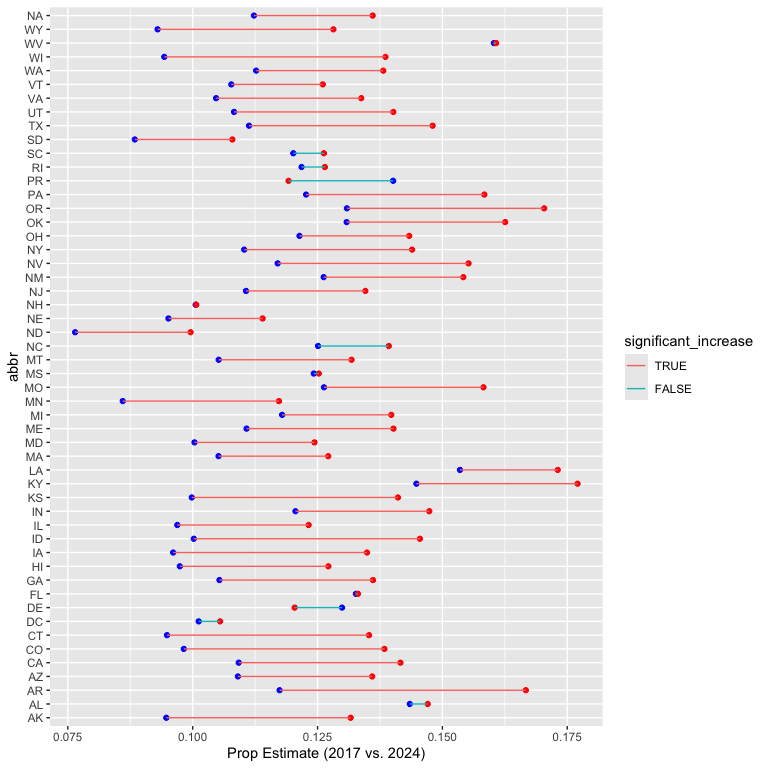

brfss_prop_tests
================
Shivalika Chavan
2025-11-23

Writing function for running prop test

``` r
run_prop_test_state = function(state_df){
  
  counts = 
    state_df |> 
    group_by(year = year(date), mental_health_not_good_days) |>
    summarize(
      n = n(), 
      .groups = "drop"
    ) |> 
    pivot_wider(
      names_from = mental_health_not_good_days,
      values_from = n
    ) |> 
    mutate(total_responses = `0` + `1-13` + `14+`) |> 
    select(`14+`, total_responses)
  
  bad_mental_health_14_counts <- counts |> pull(`14+`)
  total_counts <- counts |> pull(total_responses)
  
  if (nrow(counts) < 2) {
    return(tibble(
      NA
    ))
  }
  
  prop_test_result <- prop.test(
    x = bad_mental_health_14_counts, 
    n = total_counts, 
    alternative = "less", 
    conf.level = 0.95
  ) 
  
  prop_test_result |> 
    broom::tidy()
    
}
```

Testing function

``` r
brfss_data |> 
  filter(year(date) %in% c(2017, 2024)) |> 
  filter(state == 36) |> 
  run_prop_test_state()
## # A tibble: 1 × 9
##   estimate1 estimate2 statistic  p.value parameter conf.low conf.high method    
##       <dbl>     <dbl>     <dbl>    <dbl>     <dbl>    <dbl>     <dbl> <chr>     
## 1     0.110     0.144      70.4 2.39e-17         1       -1   -0.0274 2-sample …
## # ℹ 1 more variable: alternative <chr>


brfss_data |> 
  filter(year(date) %in% c(2017, 2024)) |> 
  filter(state == 47) |> 
  run_prop_test_state()
## # A tibble: 1 × 1
##   `NA` 
##   <lgl>
## 1 NA
```

Mapping across all states

``` r
prop_tests_state = 
  brfss_data |> 
  filter(year(date) %in% c(2017, 2024)) |>
  select(state, date, mental_health_not_good_days) |>
  group_by(state) |>
  nest() |> 
  mutate(
    test_result = map(data, run_prop_test_state)
  ) |> 
  select(-data) |> 
  unnest(cols = c(test_result)) |> 
  select(state, estimate1, estimate2, p.value, conf.low, conf.high) |> 
  mutate(
    significant_increase = p.value < 0.05
  )

prop_tests_state
## # A tibble: 54 × 7
## # Groups:   state [54]
##    state estimate1 estimate2  p.value conf.low conf.high significant_increase
##    <dbl>     <dbl>     <dbl>    <dbl>    <dbl>     <dbl> <lgl>               
##  1     1    0.143      0.147 3.22e- 1       -1   0.00869 FALSE               
##  2     2    0.0947     0.132 1.26e- 6       -1  -0.0243  TRUE                
##  3     4    0.109      0.136 2.35e- 8       -1  -0.0185  TRUE                
##  4     5    0.117      0.167 2.96e-11       -1  -0.0368  TRUE                
##  5     6    0.109      0.142 8.28e- 8       -1  -0.0221  TRUE                
##  6     8    0.0982     0.138 1.09e-14       -1  -0.0316  TRUE                
##  7     9    0.0949     0.135 1.12e-12       -1  -0.0304  TRUE                
##  8    10    0.130      0.120 8.76e- 1       -1   0.0229  FALSE               
##  9    11    0.101      0.105 3.14e- 1       -1   0.00949 FALSE               
## 10    12    0.133      0.133 4.71e- 1       -1   0.00688 FALSE               
## # ℹ 44 more rows
```

``` r
plotting_df = 
  prop_tests_state |> 
  drop_na(estimate1, estimate2) |>
  mutate(
    significant_increase = factor(significant_increase, levels = c(TRUE, FALSE))
  ) |> 
  rename(fips = state) |> 
  left_join(state_fips, by = "fips")
  

plotting_df |> 
  ggplot(aes(y = abbr)) + 
  geom_point(aes(x = estimate1), color = "blue") +
  geom_point(aes(x = estimate2), color = "red") +
  geom_segment(aes(x = estimate1, xend = estimate2, color = significant_increase))+
  xlab("Prop Estimate (2017 vs. 2024)")
```


