brfss_prop_tests
================
Shivalika Chavan
2025-11-23

### 2017 vs. 2024

Writing function for running prop test by year

``` r
run_prop_test_state = function(state_df){
  
  counts = 
    state_df |> 
    group_by(year = year(date), outcome_value) |>
    summarize(
      n = n(), 
      .groups = "drop"
      ) |> 
    filter(!is.na(outcome_value)) |> 
    pivot_wider(
      names_from = outcome_value,
      values_from = n
      ) |> 
    mutate(
      total_responses = `TRUE` + `FALSE`
      ) 
  
  x_poor_outcome <- counts |> pull(`TRUE`)
  n_total_counts <- counts |> pull(total_responses)
  
  if (nrow(counts) < 2) {
    return(tibble(NA))
  }
  
  prop_test_result <- prop.test(
    x = x_poor_outcome, 
    n = n_total_counts, 
    alternative = "less", 
    conf.level = 0.95
  ) 
  
  prop_test_result |> 
    broom::tidy()
    
}
```

Mapping across all states

``` r
outcome_vars <- c("any_physical_health_not_good_days", "any_mental_health_not_good_days",
                  "has_depressive_disorder", "has_binge_drink")
prop_tests_state = 
  brfss_data |> 
  filter(year(date) %in% c(2017, 2024)) |>
  select(state, date, all_of(outcome_vars)) |>
  pivot_longer(
        cols = all_of(outcome_vars),
        names_to = "outcome",
        values_to = "outcome_value" 
    ) |>
  group_by(state, outcome) |>
  nest() |> 
  mutate(
    test_result = map(data, run_prop_test_state)
  ) |> 
  select(-data) |> 
  unnest(cols = c(test_result)) |> 
  select(state, outcome, estimate1, estimate2, p.value, conf.low, conf.high) |> 
  mutate(
    significant_increase = p.value < 0.05
  )

prop_tests_state
## # A tibble: 216 × 8
## # Groups:   state, outcome [216]
##    state outcome                 estimate1 estimate2  p.value conf.low conf.high
##    <dbl> <chr>                       <dbl>     <dbl>    <dbl>    <dbl>     <dbl>
##  1     1 any_physical_health_no…    0.415      0.401 9.06e- 1       -1   0.0309 
##  2     1 any_mental_health_not_…    0.346      0.384 9.13e- 5       -1  -0.0209 
##  3     1 has_depressive_disorder    0.234      0.239 2.96e- 1       -1   0.00974
##  4     1 has_binge_drink            0.0876     0.109 2.34e- 4       -1  -0.0112 
##  5     2 any_physical_health_no…    0.402      0.414 1.72e- 1       -1   0.00829
##  6     2 any_mental_health_not_…    0.321      0.405 2.98e-13       -1  -0.0652 
##  7     2 has_depressive_disorder    0.171      0.210 2.79e- 5       -1  -0.0229 
##  8     2 has_binge_drink            0.154      0.150 6.64e- 1       -1   0.0185 
##  9     4 any_physical_health_no…    0.367      0.410 6.29e- 9       -1  -0.0299 
## 10     4 any_mental_health_not_…    0.311      0.393 3.09e-30       -1  -0.0697 
## # ℹ 206 more rows
## # ℹ 1 more variable: significant_increase <lgl>
```

Plotting

``` r
plotting_df = 
  prop_tests_state |> 
  rename(fips = state) |> 
  left_join(state_fips, by = "fips") |> 
  drop_na(estimate1, estimate2) |>
  mutate(
    significant_increase = factor(significant_increase, levels = c(TRUE, FALSE))
  ) 

plot_outcome_props = function(df){
  
  outcome = unique(pull(df,outcome))
  
  df |> 
    ggplot(aes(y = fct_reorder(abbr, estimate1))) + 
    geom_point(aes(x = estimate1), color = "blue") +
    geom_point(aes(x = estimate2), color = "red") +
    geom_segment(aes(x = estimate1, xend = estimate2, color = significant_increase)) + 
    scale_color_manual(
      values = c("TRUE" = "red", "FALSE" = "gray"),
      labels = c("Significant Increase (p < 0.05)", "No Significant Increase"),
      name = "Change Magnitude"
    ) +
    labs(
      title = outcome,
      subtitle = "Ordered by 2017 Rate (Estimate 1)",
      x = "Prop Estimate (2017 vs. 2024)",
      y = "State"
    )
}
  

outcome_vars_unique <- unique(pull(plotting_df,outcome))


for (current_outcome in outcome_vars_unique) {
  plot = 
    plotting_df |>
    filter(outcome == current_outcome) |> 
    plot_outcome_props()
  
  print(plot)
    
}
```

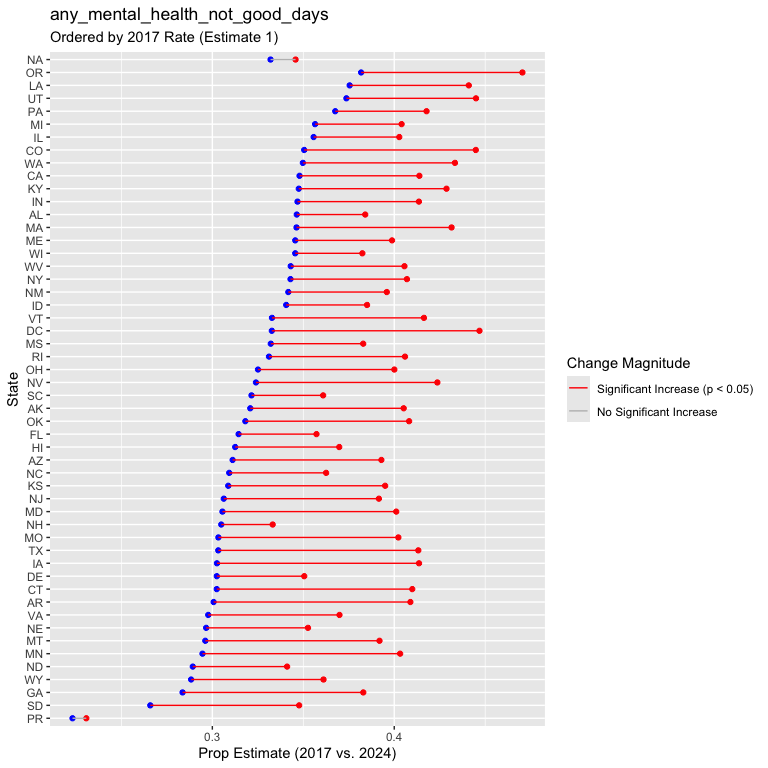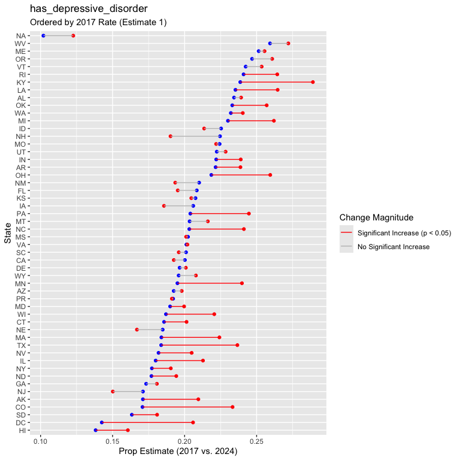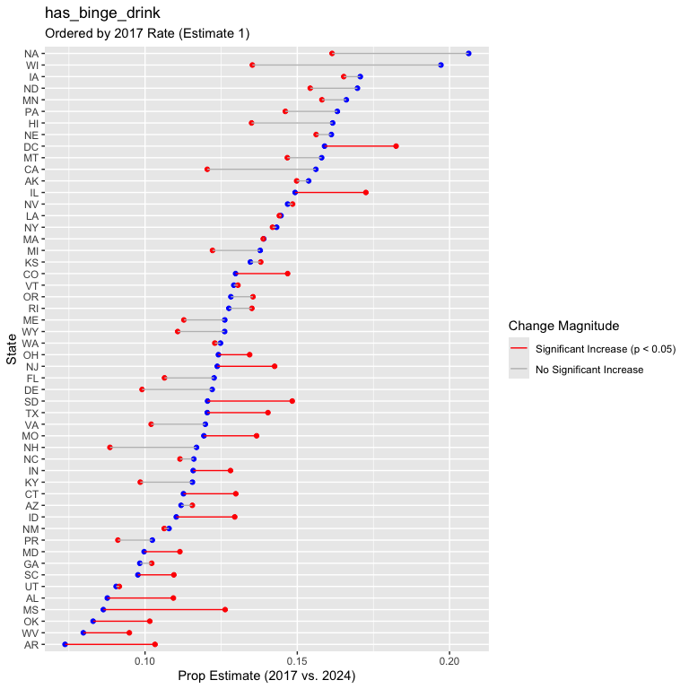

### Before and After legalization

Writing function for running prop test using `sb_legal` as the
inflection point, instead of 2024 vs 2017

``` r
run_prop_test_state_legalization = function(state_df){
  
  counts = 
    state_df |> 
    group_by(sb_legal, outcome_value) |>
    summarize(
      n = n(), 
      .groups = "drop"
      ) |> 
    filter(!is.na(outcome_value)) |> 
    pivot_wider(
      names_from = outcome_value,
      values_from = n
      ) |> 
    mutate(
      total_responses = `TRUE` + `FALSE`
      ) 
  
  x_poor_outcome <- counts |> pull(`TRUE`)
  n_total_counts <- counts |> pull(total_responses)
  
  if (nrow(counts) < 2) {
    return(tibble(NA))
  }
  
  prop_test_result <- prop.test(
    x = x_poor_outcome, 
    n = n_total_counts, 
    alternative = "less", 
    conf.level = 0.95
  ) 
  
  prop_test_result |> 
    broom::tidy()
    
}
```

Mapping across all states

``` r
prop_tests_sb_legal = 
  brfss_data |> 
  select(state, sb_legal, all_of(outcome_vars)) |>
  pivot_longer(
        cols = all_of(outcome_vars),
        names_to = "outcome",
        values_to = "outcome_value" 
    ) |>
  group_by(state, outcome) |>
  nest() |> 
  mutate(
    test_result = map(data, run_prop_test_state_legalization)
  ) |> 
  select(-data) |> 
  unnest(cols = c(test_result)) |> 
  select(state, outcome, estimate1, estimate2, p.value, conf.low, conf.high) |> 
  mutate(
    significant_increase = p.value < 0.05
  )

prop_tests_sb_legal
## # A tibble: 216 × 8
## # Groups:   state, outcome [216]
##    state outcome                estimate1 estimate2   p.value conf.low conf.high
##    <dbl> <chr>                      <dbl>     <dbl>     <dbl>    <dbl>     <dbl>
##  1     1 any_physical_health_n…    NA        NA     NA              NA   NA     
##  2     1 any_mental_health_not…    NA        NA     NA              NA   NA     
##  3     1 has_depressive_disord…    NA        NA     NA              NA   NA     
##  4     1 has_binge_drink           NA        NA     NA              NA   NA     
##  5     2 any_physical_health_n…    NA        NA     NA              NA   NA     
##  6     2 any_mental_health_not…    NA        NA     NA              NA   NA     
##  7     2 has_depressive_disord…    NA        NA     NA              NA   NA     
##  8     2 has_binge_drink           NA        NA     NA              NA   NA     
##  9     4 any_physical_health_n…     0.365     0.401  3.25e-20       -1   -0.0296
## 10     4 any_mental_health_not…     0.341     0.384  4.83e-28       -1   -0.0360
## # ℹ 206 more rows
## # ℹ 1 more variable: significant_increase <lgl>
```

Plotting

``` r
plotting_df = 
  prop_tests_sb_legal |> 
  rename(fips = state) |> 
  right_join(state_fips_legalized_only, by = "fips") |> 
  drop_na(estimate1, estimate2) |>
  mutate(
    significant_increase = factor(significant_increase, levels = c(TRUE, FALSE))
  ) 

plot_outcome_props = function(df){
  
  outcome = unique(pull(df,outcome))
  
  df |> 
    ggplot(aes(y = fct_reorder(abbr, estimate1))) + 
    geom_point(aes(x = estimate1), color = "blue") +
    geom_point(aes(x = estimate2), color = "red") +
    geom_segment(aes(x = estimate1, xend = estimate2, color = significant_increase)) + 
    scale_color_manual(
      values = c("TRUE" = "red", "FALSE" = "gray"),
      labels = c("Significant Increase (p < 0.05)", "No Significant Increase"),
      name = "Change Magnitude"
    ) +
    labs(
      title = outcome,
      subtitle = "Ordered by Pre-Legalization Rate (Estimate 1)",
      x = "Prop Estimate (Before vs. After Legalization)",
      y = "State"
    )
}
  

outcome_vars_unique <- unique(pull(plotting_df,outcome))


for (current_outcome in outcome_vars_unique) {
  plot = 
    plotting_df |>
    filter(outcome == current_outcome) |> 
    plot_outcome_props()
  
  print(plot)
    
}
```

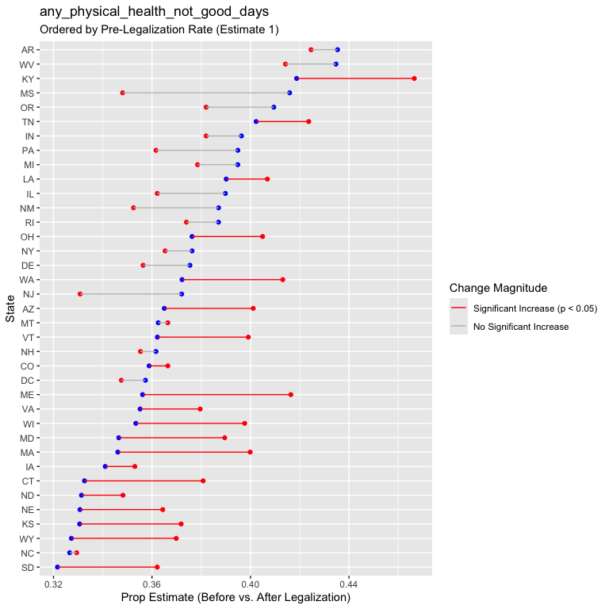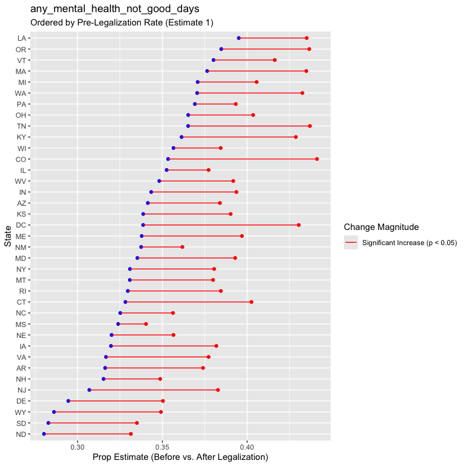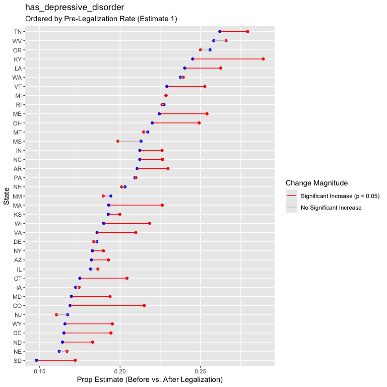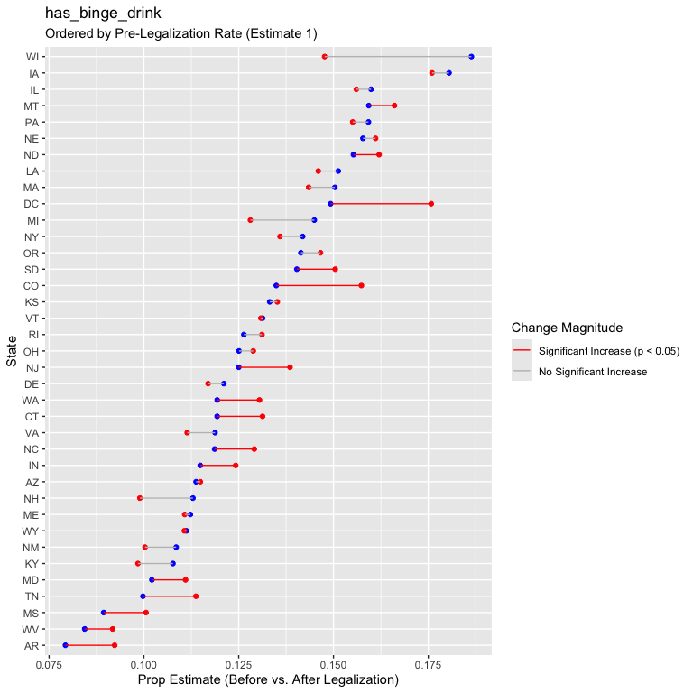

### Before and After legalization - only looking at adults \<50

``` r
prop_tests_sb_legal = 
  brfss_data |> 
  filter(age_group_5yr %in% c("18-24", "25-29", "30-34", "35-39", "40-44", "45-49")) |> 
  select(state, sb_legal, all_of(outcome_vars)) |>
  pivot_longer(
        cols = all_of(outcome_vars),
        names_to = "outcome",
        values_to = "outcome_value" 
    ) |>
  group_by(state, outcome) |>
  nest() |> 
  mutate(
    test_result = map(data, run_prop_test_state_legalization)
  ) |> 
  select(-data) |> 
  unnest(cols = c(test_result)) |> 
  select(state, outcome, estimate1, estimate2, p.value, conf.low, conf.high) |> 
  mutate(
    significant_increase = p.value < 0.05
  )

prop_tests_sb_legal
## # A tibble: 216 × 8
## # Groups:   state, outcome [216]
##    state outcome                estimate1 estimate2   p.value conf.low conf.high
##    <dbl> <chr>                      <dbl>     <dbl>     <dbl>    <dbl>     <dbl>
##  1     1 any_physical_health_n…    NA        NA     NA              NA   NA     
##  2     1 any_mental_health_not…    NA        NA     NA              NA   NA     
##  3     1 has_depressive_disord…    NA        NA     NA              NA   NA     
##  4     1 has_binge_drink           NA        NA     NA              NA   NA     
##  5     2 any_physical_health_n…    NA        NA     NA              NA   NA     
##  6     2 any_mental_health_not…    NA        NA     NA              NA   NA     
##  7     2 has_depressive_disord…    NA        NA     NA              NA   NA     
##  8     2 has_binge_drink           NA        NA     NA              NA   NA     
##  9     4 any_physical_health_n…     0.334     0.385  4.09e-13       -1   -0.0391
## 10     4 any_mental_health_not…     0.469     0.540  2.44e-22       -1   -0.0594
## # ℹ 206 more rows
## # ℹ 1 more variable: significant_increase <lgl>


plotting_df = 
  prop_tests_sb_legal |> 
  rename(fips = state) |> 
  right_join(state_fips_legalized_only, by = "fips") |> 
  drop_na(estimate1, estimate2) |>
  mutate(
    significant_increase = factor(significant_increase, levels = c(TRUE, FALSE))
  ) 


  

outcome_vars_unique <- unique(pull(plotting_df,outcome))


for (current_outcome in outcome_vars_unique) {
  plot = 
    plotting_df |>
    filter(outcome == current_outcome) |> 
    plot_outcome_props()
  
  print(plot)
    
}
```

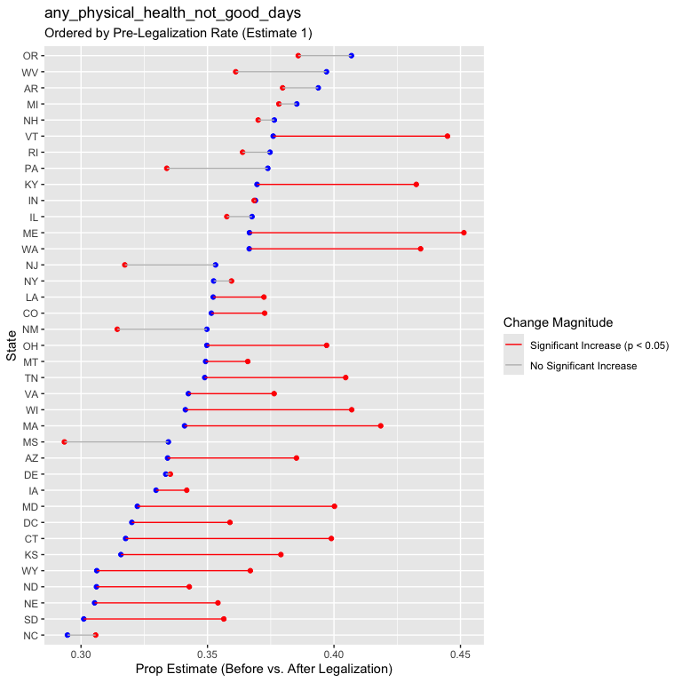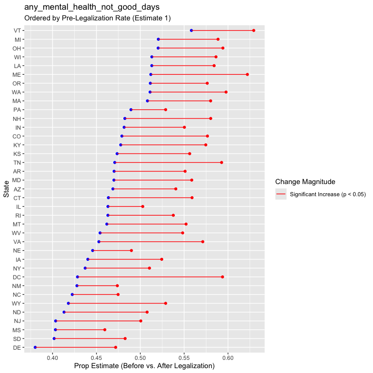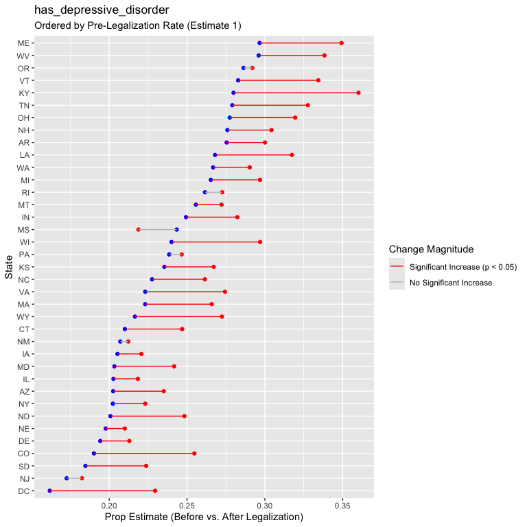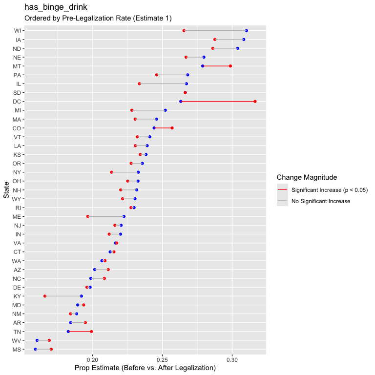
