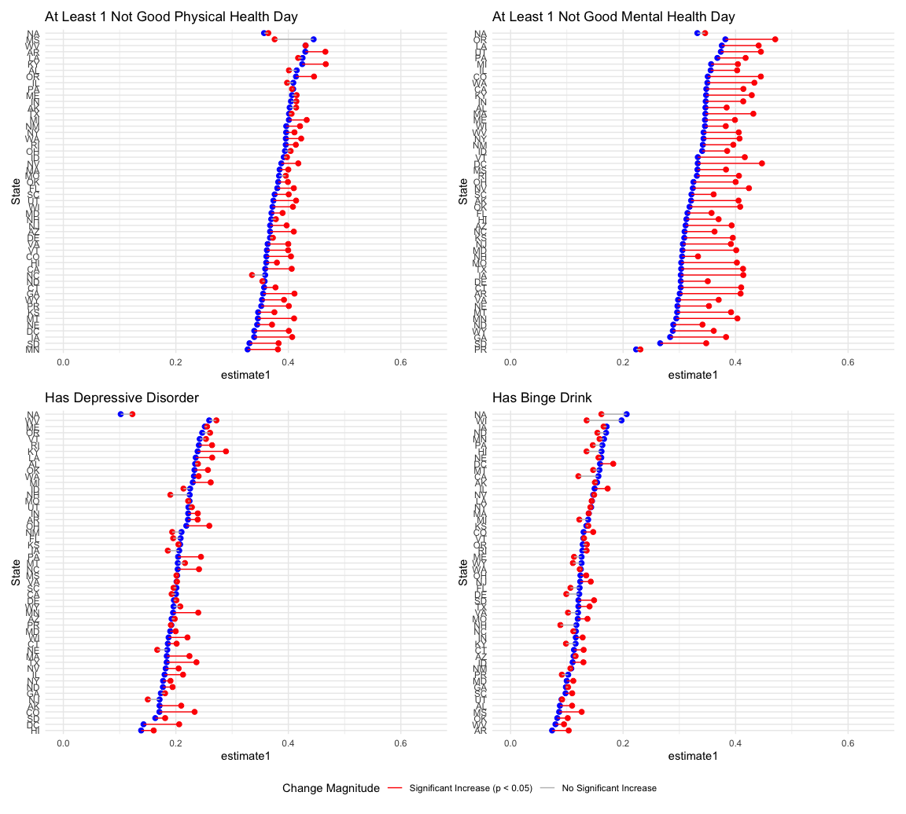

brfss_prop_tests
================
Shivalika Chavan
2025-11-23

## Comparisons

## 2017 vs. 2024

This includes all states in 2017 and 2024 and looking at the general
trend in health outcomes irrespective of legalization status.

``` r
prop_tests_state = 
  brfss_data |> 
  filter(year(date) %in% c(2017, 2024)) |>
  select(state, date, all_of(outcome_vars)) |>
  pivot_longer(
    cols = all_of(outcome_vars),
    names_to = "outcome",
    values_to = "outcome_value" 
    ) |>
  group_by(state, outcome) |>
  nest() |> 
  mutate(test_result = map(data, run_prop_test_state)) |> 
  factor_significant()

combine_plots(prop_tests_state)
```



## Before and After Legalization

Now instead of just looking at the oldest and newest available data,
let’s use sb_legal as the inflection point.

``` r
prop_tests_sb_legal = 
  brfss_data |> 
  select(state, sb_legal, all_of(outcome_vars)) |>
  pivot_longer(
    cols = all_of(outcome_vars),
    names_to = "outcome",
    values_to = "outcome_value" 
    ) |>
  group_by(state, outcome) |>
  nest() |> 
  mutate(test_result = map(data, run_prop_test_state_legalization)) |> 
  factor_significant()

  
combine_plots(prop_tests_sb_legal)
```


Going a step further, looking only at adults under 50, since a majority
of sports bettors are younger.

``` r
prop_tests_sb_legal = 
  brfss_data |> 
  filter(age_group_5yr %in% c("18-24", "25-29", "30-34", "35-39", "40-44", "45-49")) |> 
  select(state, sb_legal, all_of(outcome_vars)) |>
  pivot_longer(
    cols = all_of(outcome_vars),
    names_to = "outcome",
    values_to = "outcome_value" 
    ) |>
  group_by(state, outcome) |>
  nest() |> 
  mutate(test_result = map(data, run_prop_test_state_legalization)) |> 
  factor_significant()

combine_plots(prop_tests_sb_legal)
```


