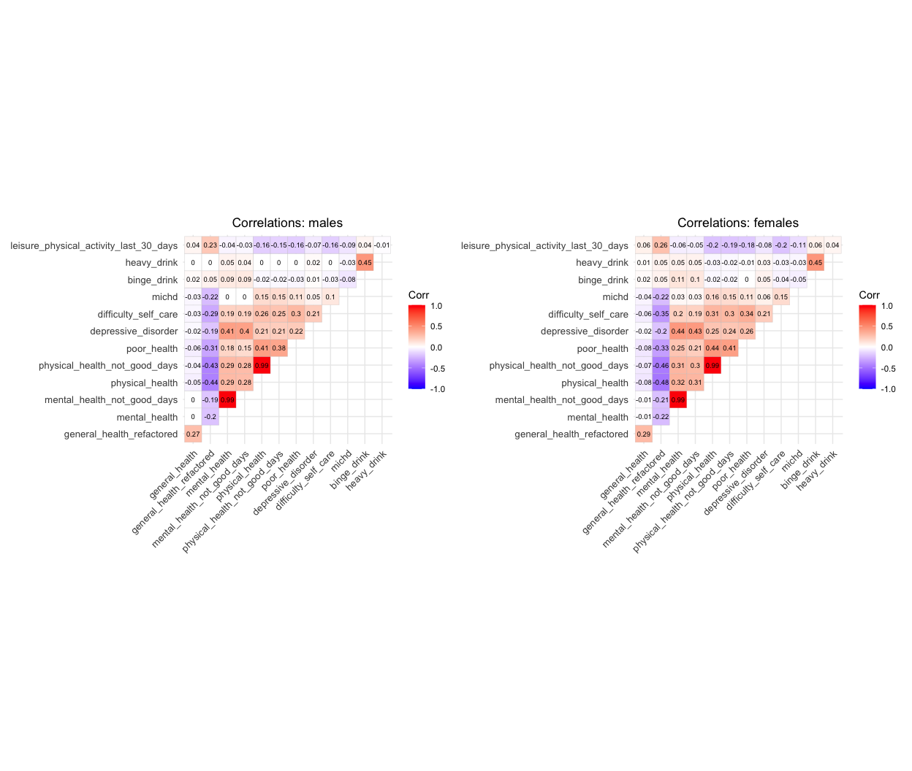

Correlation Matrix
================
Angelica Bailey
2025-11-19

Identifying relationships between health outcome variables in the
dataset with correlation matrix.

Loading in data

``` r
brfss_data = load_clean_brfss(here::here("data", "brfss_clean_2017_2024.csv"))
```

Testing correlation

``` r
#selecting variables 

correlation_vars = c("general_health","general_health_refactored", 
                     "mental_health", "mental_health_not_good_days",
                     "physical_health", "physical_health_not_good_days",
                     "poor_health", "depressive_disorder",
                     "difficulty_self_care", "michd",
                     "binge_drink", "heavy_drink", 
                     "leisure_physical_activity_last_30_days")


#stratifying datasets by sex

brfss_males = brfss_data |>
  filter(sex == "Male") |>
  select(all_of(correlation_vars)) |> 
  mutate_all(as.numeric)

brfss_females = brfss_data |>
  filter(sex == "Female") |>
  select(all_of(correlation_vars)) |> 
  mutate_all(as.numeric)
```

``` r
#creating matrices and visualizing side by side

corr_males = 
  cor(brfss_males, 
      method = "spearman",
      use = "pairwise.complete.obs") |> 
  ggcorrplot(
    type = "upper",  
    method = "square", 
    lab = TRUE,               
    lab_size = 2.5,
    tl.cex = 10,
    title = "Correlations: males") +
  theme(plot.title = element_text(hjust = 0.5))
  
corr_females =
  cor(brfss_females,
      method = "spearman",
      use = "pairwise.complete.obs") |> 
  ggcorrplot(
    type = "upper",
    method = "square",
    lab = TRUE,
    lab_size = 2.5,
    tl.cex = 10,
    title = "Correlations: females") +
  theme(plot.title = element_text(hjust = 0.5))

corr_males + corr_females
```

<!-- -->

Correlations between health variables stratified by sex does not show
significant difference between males and females.

Creating non stratified correlation matrix:

``` r
brfss_all = brfss_data |> 
  select(all_of(correlation_vars)) |> 
  mutate_all(as.numeric)

cor(brfss_all, 
      method = "spearman",
      use = "pairwise.complete.obs") |> 
  ggcorrplot(
    type = "upper",
    method = "square",
    lab = TRUE,
    lab_size = 2.5,
    tl.cex = 10,
    title = "Correlations",
    theme(plot.title = element_text(hjust = 0.5))
  )
```

<!-- -->

Comments:

- `mental_health` vs. `mental_health_not_good_days` and
  `physical_health` vs. `physical_health_not_good_days` are highly
  correlated (0.99). These are redundant variables.

- Some variables related to general well-being that show moderate
  positive correlations: `depressive_disorder` correlates moderately
  with both `mental_health` and `difficulty_self_care`. Individuals with
  depressive disorders report more poor mental health days and
  difficulty taking care of themselves. Additionally, `poor_health`
  correlates with `physical_health`(0.43) and
  `difficulty_self_care`(0.40).

- `heavy_drink` and `binge_drink` have very weak correlations with
  almost everything else. `michd` shows generally weak correlations with
  the mental health variables.

- `general_health_refactored` shows negative correlations with variables
  like `physical_health` and `mental_health`. As general health gets
  better (lower score), the number of bad health days goes up (?) This
  is an unexpected result.
