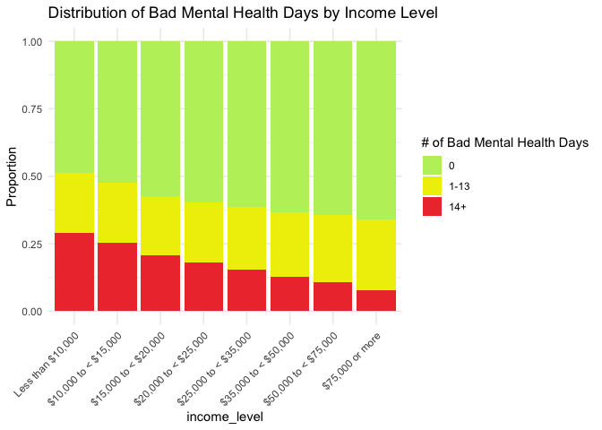
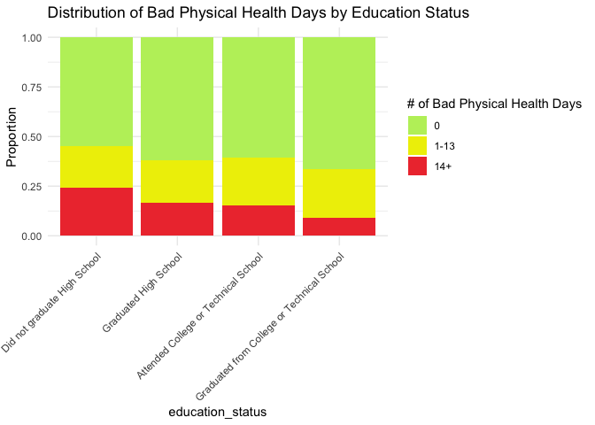
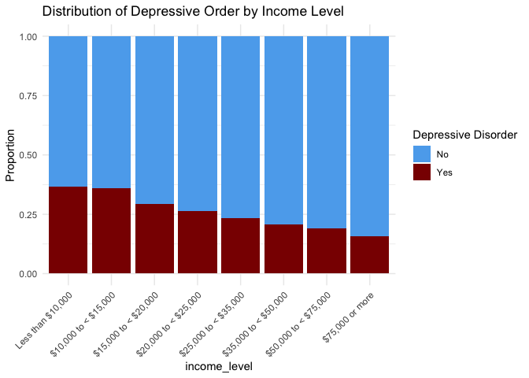
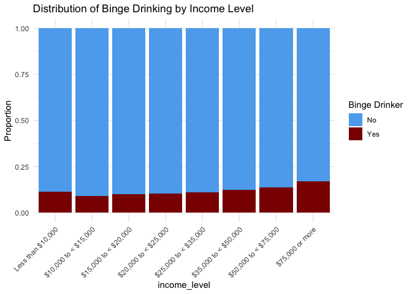

demographics_eda
================
Angelica Bailey
2025-11-22

Looking at distributions of health outcomes across key demographic and
socioeconomic variables.

Ordering factor levels for plotting

``` r
brfss_data =
  brfss_data |> 
  mutate(
    marital_status = factor(
      marital_status,
      levels = c(
        "Married",
        "Member of an unmarried couple (Partner)",
        "Never Married",
        "Divorced",
        "Separated",
        "Widowed")
    ),
    education_status = factor(
      education_status,
      levels = c(
        "Did not graduate High School",
        "Graduated High School",
        "Attended College or Technical School",
        "Graduated from College or Technical School")
    ),
    income_level = factor(
      income_level,
      levels = c(
        "Less than $10,000",
        "$10,000 to < $15,000",
        "$15,000 to < $20,000",
        "$20,000 to < $25,000",
        "$25,000 to < $35,000",
        "$35,000 to < $50,000",
        "$50,000 to < $75,000",
        "$75,000 or more")
    ),
    employment_status = factor(
      employment_status,
      levels = c(
        "Employed for wages",
        "Self-employed",
        "Homemaker",
        "Student",
        "Out of work (<1 year)",
        "Out of work (>1 year)",
        "Retired",
        "Unable to work (Disabled)"
      )
    )
  )
```

**Mental Health**

Function for plotting mental health by a demographic variable

``` r
plot_mental_health = function(demo_var, plot_title) {
  
    brfss_data |> 
    filter(
      !is.na(.data[[demo_var]]),
      !is.na(mental_health_not_good_days)
    ) |> 
  
  ggplot(aes(x = .data[[demo_var]], fill = mental_health_not_good_days)) +
    geom_bar(position = "fill") +
    scale_fill_manual(
    values = c(
      "0" = "darkolivegreen2",
      "1-13" = "yellow2",
      "14+" = "brown2"
    ),
    name = "# of Bad Mental Health Days"
  ) +
    labs(
      x = demo_var,
      y = "Proportion",
      title = plot_title
    ) +
    theme_minimal() +
    theme(axis.text.x = element_text(angle = 45, hjust = 1))
  
}
```

Calling function:

Ex: Plotting mental health by income level

``` r
plot_mental_health(
  demo_var = "income_level",
  plot_title = "Distribution of Bad Mental Health Days by Income Level"
)
```

<!-- -->

**Physical Health**

Function for plotting physical health by a demographic variable

``` r
plot_physical_health = function(brfss_data, demo_var, plot_title) {
  
    brfss_data |> 
    drop_na(physical_health_not_good_days) |> 
    drop_na(.data[[demo_var]]) |> 
  
  ggplot(aes(x = .data[[demo_var]], fill = physical_health_not_good_days)) +
    geom_bar(position = "fill") +
    scale_fill_manual(
    values = c(
      "0" = "darkolivegreen2",
      "1-13" = "yellow2",
      "14+" = "brown2"
    ),
    name = "# of Bad Physical Health Days"
  ) +
    labs(
      x = demo_var,
      y = "Proportion",
      title = plot_title
    ) +
    theme_minimal() +
    theme(axis.text.x = element_text(angle = 45, hjust = 1))
  
}
```

Calling function:

Ex: Plotting physical health by education status

``` r
plot_physical_health(
  brfss_data,
  demo_var = "education_status",
  plot_title = "Distribution of Bad Physical Health Days by Education Status"
)
```

    ## Warning: Use of .data in tidyselect expressions was deprecated in tidyselect 1.2.0.
    ## ℹ Please use `all_of(var)` (or `any_of(var)`) instead of `.data[[var]]`
    ## This warning is displayed once every 8 hours.
    ## Call `lifecycle::last_lifecycle_warnings()` to see where this warning was
    ## generated.

<!-- -->

**Depressive Disorder**

Function for plotting depressive disorder by a demographic variable

``` r
plot_depression = function(demo_var, plot_title) {
  
    brfss_data |> 
    drop_na(depressive_disorder) |> 
    drop_na(.data[[demo_var]]) |> 
  
  ggplot(aes(x = .data[[demo_var]], fill = depressive_disorder)) +
    geom_bar(position = "fill") +
    scale_fill_manual(
    values = c(
      "No" = "steelblue2",
      "Yes" = "red4"
    ),
    name = "Depressive Disorder"
  ) +
    labs(
      x = demo_var,
      y = "Proportion",
      title = plot_title
    ) +
    theme_minimal() +
    theme(axis.text.x = element_text(angle = 45, hjust = 1))
}
```

Calling function

``` r
plot_depression(
  demo_var = "income_level",
  plot_title = "Distribution of Depressive Order by Income Level"
)
```

<!-- -->

**Binge Drink**

Function for plotting binge drinking by a demographic variable

``` r
plot_bingedrink = function(demo_var, plot_title) {
  
    brfss_data |> 
    drop_na(binge_drink) |> 
    drop_na(.data[[demo_var]]) |> 
  
  ggplot(aes(x = .data[[demo_var]], fill = binge_drink)) +
    geom_bar(position = "fill") +
    scale_fill_manual(
    values = c(
      "No" = "steelblue2",
      "Yes" = "red4"
    ),
    name = "Binge Drinker"
  ) +
    labs(
      x = demo_var,
      y = "Proportion",
      title = plot_title
    ) +
    theme_minimal() +
    theme(axis.text.x = element_text(angle = 45, hjust = 1))
}
```

Calling function

``` r
plot_bingedrink(
  demo_var = "income_level",
  plot_title = "Distribution of Binge Drinking by Income Level"
)
```

<!-- -->
