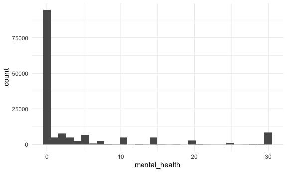
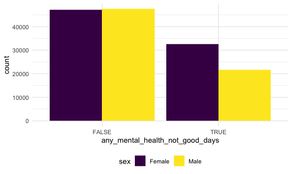
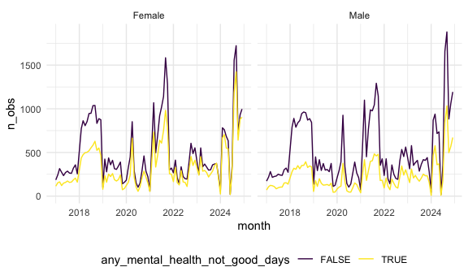
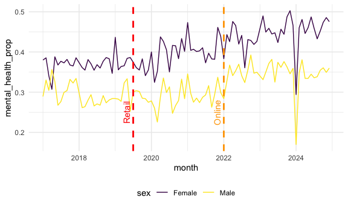
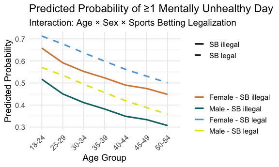

linear_regression
================
2025-11-24

# Looks at one state

Look at one state for our outcome of interest:

``` r
ny_df = brfss_data |> 
  filter(
    state == 36,
    !is.na(sex),
    !is.na(any_mental_health_not_good_days)
  ) |> 
  mutate(
    month = lubridate::floor_date(date, unit = "month")
)
#    age_group_5yr %in% c("18-24", "25-29", "30-34", "35-39", "40-44", "45-49", "50-54")
#    ) |> 
#  filter(!is.na(sex) & !is.na(mental_health_not_good_days)) #|> 
  #mutate(
  #  month = lubridate::floor_date(date, unit = "month"),
  #  mental_health_flag = case_when(
  #    mental_health_not_good_days %in% c("1-13", "14+") ~ 1,
  #    mental_health_not_good_days == 0 ~ 0
  #  )
#  ) 


ny_df |> 
  ggplot(aes(x = mental_health)) + 
  geom_histogram()
```

    ## `stat_bin()` using `bins = 30`. Pick better value `binwidth`.



``` r
ny_df |> 
  group_by(sex) |> 
  ggplot(aes(x = any_mental_health_not_good_days, fill=sex)) + 
  geom_bar(stat = "count", position = "dodge")
```



``` r
ny_df |> 
  group_by(sex, month, any_mental_health_not_good_days) |> 
  summarize(
    n_obs = n()
  ) |> 
  ggplot(aes(x=month, y=n_obs, color=any_mental_health_not_good_days)) + 
  geom_line() +
  facet_grid(. ~ sex)
```

    ## `summarise()` has grouped output by 'sex', 'month'. You can override using the
    ## `.groups` argument.



``` r
ny_df |> 
  group_by(sex, month) |> 
  summarize(
    n_obs = n(),
    mental_health_n = sum(any_mental_health_not_good_days)
  ) |> 
  mutate(
    mental_health_prop = mental_health_n / n_obs
  ) |> 
  ggplot(aes(x=month, y=mental_health_prop, color=sex)) + 
  geom_line() +
  geom_vline(xintercept = as.Date("2019-07-01"), 
                 linetype = "dashed", color = "red", linewidth = 1) +
  annotate("text", x = as.Date("2019-07-01"), y = 0.25, label = "Retail", 
           angle = 90, vjust = -0.5, color = "red") +
  geom_vline(xintercept = as.Date("2022-01-01"), 
                 linetype = "dashed", color = "orange", linewidth = 1) +
  annotate("text", x = as.Date("2022-01-01"), y = 0.25, label = "Online", 
           angle = 90, vjust = -0.5, color = "orange")
```

    ## `summarise()` has grouped output by 'sex'. You can override using the `.groups`
    ## argument.



# Set up Regression

``` r
fit_null = lm(any_mental_health_not_good_days ~ sex + age_group_5yr, data = brfss_data)
fit_alt = lm(any_mental_health_not_good_days ~ sb_legal + sex + age_group_5yr, data = brfss_data)

fit_null |> 
  broom::tidy()
```

    ## # A tibble: 14 × 5
    ##    term                     estimate std.error statistic   p.value
    ##    <chr>                       <dbl>     <dbl>     <dbl>     <dbl>
    ##  1 (Intercept)                0.664   0.00124      535.  0        
    ##  2 sexMale                   -0.123   0.000571    -216.  0        
    ##  3 age_group_5yr25-29        -0.0480  0.00179      -26.9 4.77e-159
    ##  4 age_group_5yr30-34        -0.0872  0.00172      -50.8 0        
    ##  5 age_group_5yr35-39        -0.119   0.00167      -71.5 0        
    ##  6 age_group_5yr40-44        -0.151   0.00165      -91.6 0        
    ##  7 age_group_5yr45-49        -0.176   0.00164     -107.  0        
    ##  8 age_group_5yr50-54        -0.205   0.00157     -130.  0        
    ##  9 age_group_5yr55-59        -0.236   0.00152     -155.  0        
    ## 10 age_group_5yr60-64        -0.280   0.00148     -190.  0        
    ## 11 age_group_5yr65-69        -0.332   0.00147     -227.  0        
    ## 12 age_group_5yr70-74        -0.358   0.00149     -240.  0        
    ## 13 age_group_5yr75-79        -0.384   0.00158     -243.  0        
    ## 14 age_group_5yr80 or older  -0.425   0.00154     -276.  0

``` r
fit_alt |> 
  broom::tidy()
```

    ## # A tibble: 15 × 5
    ##    term                     estimate std.error statistic   p.value
    ##    <chr>                       <dbl>     <dbl>     <dbl>     <dbl>
    ##  1 (Intercept)                0.652   0.00153      426.  0        
    ##  2 sb_legal                   0.0486  0.000670      72.5 0        
    ##  3 sexMale                   -0.126   0.000674    -187.  0        
    ##  4 age_group_5yr25-29        -0.0506  0.00215      -23.5 3.55e-122
    ##  5 age_group_5yr30-34        -0.0896  0.00207      -43.4 0        
    ##  6 age_group_5yr35-39        -0.123   0.00201      -61.3 0        
    ##  7 age_group_5yr40-44        -0.158   0.00199      -79.4 0        
    ##  8 age_group_5yr45-49        -0.181   0.00196      -92.2 0        
    ##  9 age_group_5yr50-54        -0.209   0.00188     -111.  0        
    ## 10 age_group_5yr55-59        -0.241   0.00182     -133.  0        
    ## 11 age_group_5yr60-64        -0.289   0.00177     -164.  0        
    ## 12 age_group_5yr65-69        -0.341   0.00175     -195.  0        
    ## 13 age_group_5yr70-74        -0.367   0.00178     -206.  0        
    ## 14 age_group_5yr75-79        -0.393   0.00189     -208.  0        
    ## 15 age_group_5yr80 or older  -0.433   0.00184     -235.  0

Filter age group \< 55 (and sports betting legal, check before covid)

``` r
brfss_age_data = brfss_data |> 
  filter(
    age_group_5yr %in% 
      c("18-24","25-29","30-34","35-39","40-44","45-49","50-54"),
    sb_legal %in% c(0, 1)) #,
    
    #year(date) < 2020)
```

Nested models:

``` r
fit_nest =  lm(any_mental_health_not_good_days ~ sex * sb_legal + age_group_5yr * sb_legal, data = brfss_age_data) 

fit_nest |> 
  broom::tidy()
```

    ## # A tibble: 16 × 5
    ##    term                        estimate std.error statistic   p.value
    ##    <chr>                          <dbl>     <dbl>     <dbl>     <dbl>
    ##  1 (Intercept)                  0.658     0.00233   283.    0        
    ##  2 sexMale                     -0.141     0.00156   -90.5   0        
    ##  3 sb_legal                     0.0544    0.00331    16.4   1.12e- 60
    ##  4 age_group_5yr25-29          -0.0665    0.00322   -20.7   4.94e- 95
    ##  5 age_group_5yr30-34          -0.106     0.00310   -34.1   3.78e-255
    ##  6 age_group_5yr35-39          -0.135     0.00301   -44.8   0        
    ##  7 age_group_5yr40-44          -0.168     0.00300   -56.1   0        
    ##  8 age_group_5yr45-49          -0.183     0.00291   -62.9   0        
    ##  9 age_group_5yr50-54          -0.210     0.00277   -75.6   0        
    ## 10 sexMale:sb_legal            -0.00120   0.00222    -0.542 5.88e-  1
    ## 11 sb_legal:age_group_5yr25-29  0.0309    0.00457     6.77  1.33e- 11
    ## 12 sb_legal:age_group_5yr30-34  0.0300    0.00438     6.86  7.12e- 12
    ## 13 sb_legal:age_group_5yr35-39  0.0213    0.00425     5.00  5.67e-  7
    ## 14 sb_legal:age_group_5yr40-44  0.0170    0.00421     4.04  5.37e-  5
    ## 15 sb_legal:age_group_5yr45-49  0.00153   0.00416     0.367 7.14e-  1
    ## 16 sb_legal:age_group_5yr50-54 -0.00203   0.00399    -0.508 6.12e-  1

Use this model, our reference categories are Female and 18-25

``` r
fit =  lm(any_mental_health_not_good_days ~ sex + age_group_5yr + sb_legal 
                             + sex * sb_legal 
                             + age_group_5yr * sb_legal, data = brfss_age_data) 
fit_result = fit |> 
  broom::tidy() |> 
  select(term, estimate, std.error, p.value)

fit_result |> 
  knitr::kable(digits = 3)
```

| term                        | estimate | std.error | p.value |
|:----------------------------|---------:|----------:|--------:|
| (Intercept)                 |    0.658 |     0.002 |   0.000 |
| sexMale                     |   -0.141 |     0.002 |   0.000 |
| age_group_5yr25-29          |   -0.067 |     0.003 |   0.000 |
| age_group_5yr30-34          |   -0.106 |     0.003 |   0.000 |
| age_group_5yr35-39          |   -0.135 |     0.003 |   0.000 |
| age_group_5yr40-44          |   -0.168 |     0.003 |   0.000 |
| age_group_5yr45-49          |   -0.183 |     0.003 |   0.000 |
| age_group_5yr50-54          |   -0.210 |     0.003 |   0.000 |
| sb_legal                    |    0.054 |     0.003 |   0.000 |
| sexMale:sb_legal            |   -0.001 |     0.002 |   0.588 |
| age_group_5yr25-29:sb_legal |    0.031 |     0.005 |   0.000 |
| age_group_5yr30-34:sb_legal |    0.030 |     0.004 |   0.000 |
| age_group_5yr35-39:sb_legal |    0.021 |     0.004 |   0.000 |
| age_group_5yr40-44:sb_legal |    0.017 |     0.004 |   0.000 |
| age_group_5yr45-49:sb_legal |    0.002 |     0.004 |   0.714 |
| age_group_5yr50-54:sb_legal |   -0.002 |     0.004 |   0.612 |

### Baseline differences in mental health

Sex: Men have a 14.114848 percentage point lower probability of
reporting ≥1 mentally unhealthy day compared to women (p \< 0.001).

Age: All age coefficients are negative, meaning older groups report
fewer mentally unhealthy days than 18–24-year-olds.

This matches known demographic patterns typical in BRFSS mental health
data.

### Overall effect of sports betting legality (sb_legal)

Main effect: sb_legal = 0.054 0.05444(p \< 0.001)

In the reference group (female, age 18–24), living in a state where
sports betting is legal is associated with a +5.4 5.4439964 percentage
point higher probability of reporting ≥1 mentally unhealthy day in the
past month.

### Does the effect differ by sex?

Interaction: sexMale × sb_legal = -0.001 -0.0012045 (p = 0.588
0.5876745)

There is no meaningful difference in the effect of sports betting
legalization between men and women. The coefficient is tiny (–0.1
percentage points) and not statistically significant.

### Differences by age group

Each age interaction term tells us how much the effect of sports betting
legality differs from the reference group (18–24).

Significant positive interactions: \| Age group \| Interaction estimate
\| Interpretation \| \| :——- \| :——- \| :——- \|

``` r
fit_result |> 
  filter(str_starts(term, "age_group_") & str_ends(term, "sb_legal")) |> 
  select(term, estimate, p.value) |> 
  mutate(
    term = str_replace_all(term, c("age_group_5yr"="", ":sb_legal"=""))
  ) |> 
  rename("Age Group" = term) |> 
  knitr::kable()
```

| Age Group |   estimate |   p.value |
|:----------|-----------:|----------:|
| 25-29     |  0.0308994 | 0.0000000 |
| 30-34     |  0.0300433 | 0.0000000 |
| 35-39     |  0.0212802 | 0.0000006 |
| 40-44     |  0.0170216 | 0.0000537 |
| 45-49     |  0.0015281 | 0.7136341 |
| 50-54     | -0.0020271 | 0.6117864 |

The effect is largest for adults 25-29 (0.0308994) and not significant
for adults 45-49 and 50-54.

The impact of sports betting legalization on mentally unhealthy days
appears stronger for younger adults (25–44) but then plateaus.

### Overall Conclusions:

- After adjusting for sex and age, living in a state with legal sports
  betting is associated with higher probability of having mentally
  unhealthy days, especially among adults aged 25–44.
- The effect size is around 5–8 percentage points, depending on age
  group.
- Men and women are affected similarly.
- Younger adults (18–24) have the highest baseline mental health risk,
  but legalization effects are somewhat stronger for those 25–44.
- These associations cannot establish causality (due to cross-sectional
  BRFSS data), but they indicate a robust correlation.

## Predicted Probability of ≥1 Mentally Unhealthy Day

``` r
# Build prediction grid
pred_df = expand.grid(
  sex = c("Female", "Male"),
  age_group_5yr = c("18-24","25-29","30-34","35-39","40-44","45-49","50-54"),
  sb_legal = c(0, 1)   # illegal = 0, legal = 1
)

# Get predicted probabilities and plot
pred_df |> 
  mutate(pred_prob = predict(fit, newdata = pred_df)) |> 
  ggplot(aes(x = age_group_5yr, y = pred_prob,
                    color = interaction(sex, sb_legal),
                    group = interaction(sex, sb_legal),
                    linetype = factor(sb_legal))) +
  geom_line(size = 1.1) +
  scale_color_manual(
    name = "",
    values = c(
      "Female.0" = "#D98841",  # orange solid
      "Female.1" = "#5DA5DA",  # blue dashed
      "Male.0"   = "#017371",  # green solid
      "Male.1"   = "#E5E500"   # yellow dashed
    ),
    labels = c(
      "Female.0" = "Female - SB illegal",
      "Female.1" = "Female - SB legal",
      "Male.0"   = "Male - SB illegal",
      "Male.1"   = "Male - SB legal"
    )
  ) +
  scale_linetype_manual(
    name = "",
    values = c("0" = "solid", "1" = "dashed"),
    labels = c("0" = "SB illegal", "1" = "SB legal")
  ) +
  labs(
    x = "Age Group",
    y = "Predicted Probability",
    title = "Predicted Probability of ≥1 Mentally Unhealthy Day",
    subtitle = "Interaction: Age × Sex × Sports Betting Legalization"
  ) +
  theme_minimal(base_size = 14) +
  theme(
    legend.position = "right",
    axis.text.x = element_text(angle = 45, hjust = 1)
  )
```

    ## Warning: Using `size` aesthetic for lines was deprecated in ggplot2 3.4.0.
    ## ℹ Please use `linewidth` instead.
    ## This warning is displayed once every 8 hours.
    ## Call `lifecycle::last_lifecycle_warnings()` to see where this warning was
    ## generated.



The graph shows how the predicted probability of reporting at least one
mentally unhealthy day in the past month varies across age groups, sex,
and whether sports betting is legal in the respondent’s state.

- Baseline trends:
  - When sports betting is not legal: women consistently report higher
    rates of mentally unhealthy days than men across all age groups.
  - Both sexes show a steady decline in mentally unhealthy days as age
    increases, with 18–24-year-olds exhibiting the highest risk and
    50–54-year-olds the lowest.
- Effect of sports betting legalization:
  - Across nearly all age groups, the dashed lines (SB legal) lie above
    the corresponding solid lines (SB illegal) which means sports
    betting legalization is associated with a higher probability of
    reporting mentally unhealthy days.
  - The size of this increase varies by age
  - The difference is largest among young and early-mid adults,
    especially ages 25–44.
- Differences between men and women
  - The vertical distance between male and female lines remains fairly
    constant regardless of legalization status, which indicates women
    consistently report more mentally unhealthy days than men.
  - The effect of sports betting legalization is similar for both sexes
    (supports the non-significant sex × legalization interaction in the
    model).
- Age × legalization interaction
  - The graph visually confirms the pattern in the coefficients:
  - Among younger adults (25–44), the increase associated with sports
    betting legalization is noticeably larger.
  - By 45–54, the effect is small or negligible.
  - This suggests that younger and mid-age adults may be more sensitive
    to environmental or policy changes related to gambling or these age
    groups may participate more in gambling or be more exposed to
    advertising or technology that connects them to sports betting
    markets.

Sports betting legalization is associated with a higher probability of
experiencing mentally unhealthy days, especially among adults aged
25–44, and this pattern is similar for both men and women. The effect
does not appear uniform across age groups, indicating a meaningful age ×
policy interaction.

``` r
fit_nest_model =
  brfss_age_data |> 
  nest(data = -sex) |> 
  mutate(
    models = map(data, \(df) lm(mental_health ~ sb_legal + age_group_5yr, data = df)),
    results = map(models, broom::tidy)) |> 
  select(-data, -models) |> 
  unnest(results)

fit_nest_model |> 
  select(sex, term, estimate) |> 
  mutate(term = fct_inorder(term)) |> 
  pivot_wider(
    names_from = term, values_from = estimate) |> 
  knitr::kable(digits = 3)
```

| sex    | (Intercept) | sb_legal | age_group_5yr25-29 | age_group_5yr30-34 | age_group_5yr35-39 | age_group_5yr40-44 | age_group_5yr45-49 | age_group_5yr50-54 |
|:-------|------------:|---------:|-------------------:|-------------------:|-------------------:|-------------------:|-------------------:|-------------------:|
| Female |       7.897 |    0.930 |             -1.217 |             -1.847 |             -2.308 |             -2.620 |             -2.691 |             -2.904 |
| Male   |       5.092 |    0.702 |             -0.258 |             -0.617 |             -0.909 |             -1.355 |             -1.570 |             -1.793 |
| NA     |      11.114 |   -8.400 |             -3.079 |             -2.714 |             -1.358 |             -6.714 |             -5.720 |             -5.475 |

Look at Fixed Effect Model (eval=FALSE):

``` r
# Outcome: Use the binary outcome for the test (e.g., 14+ bad mental health days)
outcome = "any_mental_health_not_good_days" 

# Treatment: The binary indicator for legalization exposure
treatment = "sb_legal"

# Demographics (must be continuous or factor/dummy variables)
demographic_predictors = c("sex", "income_level", "education_status", "marital_status", 
                            "race", "employment_status", "children_in_household",
                            "age_group_5yr")

# Fixed Effects (Defined as factors in your cleaning pipeline)
FEs = c("state", "month")

# Construct the formula string
formula_str <- paste(
    outcome, 
    "~", 
    treatment, 
    "+", 
    paste(demographic_predictors, collapse = " + "), 
    "|", 
    paste(FEs, collapse = " + ")
)

# Convert to a formula object
model_formula = as.formula(formula_str)

# Run the DiD regression:
model_result = feols(
    model_formula,
    data = brfss_data,
    # Cluster standard errors by state to account for correlation within states
    cluster = ~state 
)

# Print the results
summary(model_result)
```
