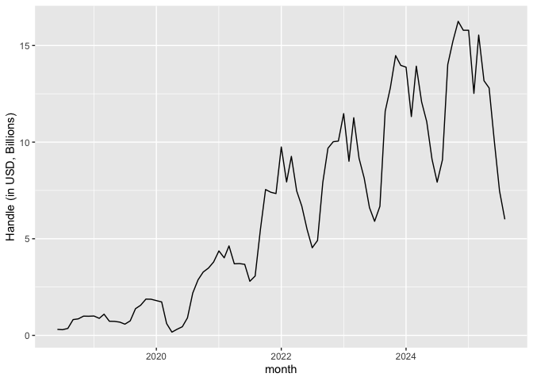
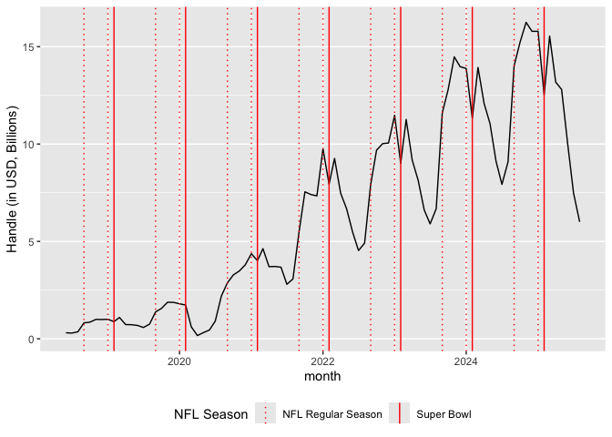
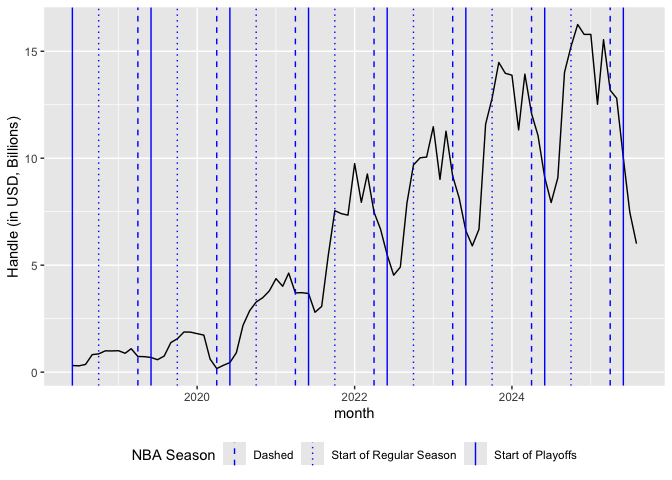
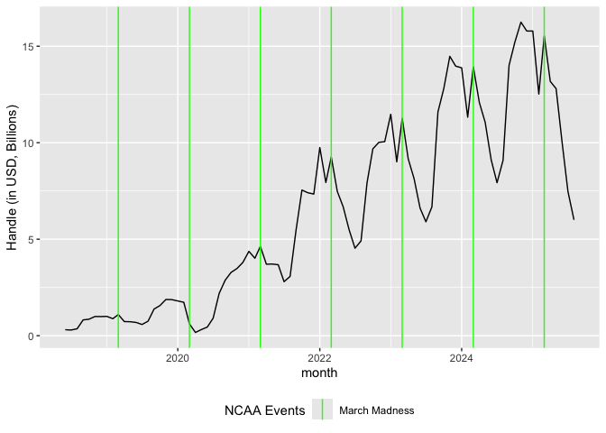
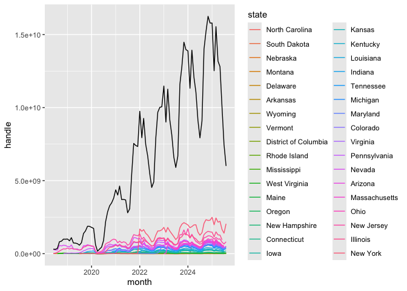

EDA: Spikes in Total Handle
================
Shivalika Chavan
2025-11-19

The purpose of this EDA is to take a closer look at the spikes observed
in handle. Are these coinciding with sports seasons? Are the different
across states?

``` r
library(tidyverse)
```

    ## ── Attaching core tidyverse packages ──────────────────────── tidyverse 2.0.0 ──
    ## ✔ dplyr     1.1.4     ✔ readr     2.1.5
    ## ✔ forcats   1.0.0     ✔ stringr   1.5.1
    ## ✔ ggplot2   3.5.2     ✔ tibble    3.3.0
    ## ✔ lubridate 1.9.4     ✔ tidyr     1.3.1
    ## ✔ purrr     1.1.0     
    ## ── Conflicts ────────────────────────────────────────── tidyverse_conflicts() ──
    ## ✖ dplyr::filter() masks stats::filter()
    ## ✖ dplyr::lag()    masks stats::lag()
    ## ℹ Use the conflicted package (<http://conflicted.r-lib.org/>) to force all conflicts to become errors

``` r
sb_rev_by_month = read_csv(here::here("data", "legal_sports_report", "sb_rev_by_month.csv"))
```

    ## Rows: 87 Columns: 5
    ## ── Column specification ────────────────────────────────────────────────────────
    ## Delimiter: ","
    ## dbl  (4): handle, revenue, hold, taxes
    ## date (1): month
    ## 
    ## ℹ Use `spec()` to retrieve the full column specification for this data.
    ## ℹ Specify the column types or set `show_col_types = FALSE` to quiet this message.

``` r
sb_rev_by_state = read_csv(here::here("data", "legal_sports_report", "sb_rev_by_state.csv"))
```

    ## Rows: 40 Columns: 5
    ## ── Column specification ────────────────────────────────────────────────────────
    ## Delimiter: ","
    ## chr (1): market
    ## dbl (4): handle, revenue, hold, taxes
    ## 
    ## ℹ Use `spec()` to retrieve the full column specification for this data.
    ## ℹ Specify the column types or set `show_col_types = FALSE` to quiet this message.

``` r
sb_rev_by_state_month = read_csv(here::here("data", "legal_sports_report", "sb_rev_by_state_month.csv"))
```

    ## Rows: 1975 Columns: 6
    ## ── Column specification ────────────────────────────────────────────────────────
    ## Delimiter: ","
    ## chr  (1): state
    ## dbl  (4): handle, revenue, hold, taxes
    ## date (1): month
    ## 
    ## ℹ Use `spec()` to retrieve the full column specification for this data.
    ## ℹ Specify the column types or set `show_col_types = FALSE` to quiet this message.

Looking first at trends in handle by month:

``` r
sb_rev_by_month |> 
  mutate(handle_B = handle / 1e9) |> 
  ggplot(aes(x = month, y = handle_B)) + 
  geom_line() + 
  ylab("Handle (in USD, Billions)")
```

<!-- --> We
see some pretty obvious cyclical trends, probably coinciding with events
in different sports seasons.

## Trends by Sport

NFL Season:

``` r
years_in_data = unique(year(sb_rev_by_month$month)) 

nfl_event_dates = tibble(
  date = c(
    ymd(paste(years_in_data, "09", "01", sep = "-")),
    ymd(paste(years_in_data, "01", "01", sep = "-")),
    ymd(paste(years_in_data, "02", "01", sep = "-"))
    ),
  
  type = case_when(
    month(date) == 2 ~ "Solid", 
    TRUE ~ "Dotted" 
    ),
  
  label = case_when(
    month(date) == 9 ~ "Start of Season",
    month(date) == 1 ~ "End of Season",
    month(date) == 2 ~ "Super Bowl"
    )
  ) |> 
  filter(date >= min(sb_rev_by_month$month), date <= max(sb_rev_by_month$month))


sb_rev_by_month |>
  mutate(handle_B = handle / 1e9) |>
  ggplot(aes(x = month, y = handle_B)) +
  geom_line() +
  ylab("Handle (in USD, Billions)") +
  geom_vline(
    data = nfl_event_dates,
    aes(xintercept = date, linetype = type),
    color = "red",
    show.legend = TRUE 
  ) +
  scale_linetype_manual(
    name = "NFL Season", 
    values = c("Dotted" = "dotted", "Solid" = "solid"), 
    labels = c("Dotted" = "NFL Regular Season", "Solid" = "Super Bowl") 
  ) + 
  theme(legend.position="bottom")
```

<!-- --> We
see the peaks in sports betting primary occur during the NFL Season,
with a trough occuring during the Superbowl. This is likely because it
is only 1 game, whereas people can place many bets, including prop bets,
on several games in the regular season. This correlates with a higher
total handle.

NBA Season:

``` r
nba_event_dates = tibble(
  date = c(
    ymd(paste(years_in_data, "10", "01", sep = "-")),
    ymd(paste(years_in_data, "04", "01", sep = "-")),
    ymd(paste(years_in_data, "06", "01", sep = "-"))
    ),
  
  type = case_when(
    month(date) == 6 ~ "Solid", 
    month(date) == 4 ~ "Dashed", 
    TRUE ~ "Dotted" 
    ),
  
  label = case_when(
    month(date) == 6 ~ "NBA Finals",
    month(date) == 4 ~ "Start of Playoffs",
    month(date) == 10 ~ "Start of Regular Season"
    )
  ) |> 
  filter(date >= min(sb_rev_by_month$month), date <= max(sb_rev_by_month$month))


sb_rev_by_month |>
  mutate(handle_B = handle / 1e9) |>
  ggplot(aes(x = month, y = handle_B)) +
  geom_line() +
  ylab("Handle (in USD, Billions)") +
  geom_vline(
    data = nba_event_dates,
    aes(xintercept = date, linetype = type),
    color = "blue",
    show.legend = TRUE 
  ) +
  scale_linetype_manual(
    name = "NBA Season", 
    values = c("Dotted" = "dotted", "Solid" = "solid", "Dashed" = "dashed"), 
    labels = c("Dotted" = "Start of Regular Season", "Solid" = "NBA Finals", "Solid" = "Start of Playoffs") 
  ) + 
  theme(legend.position="bottom")
```

<!-- --> No
trends align with NBA Season, surprisingly.

NCAA Season:

``` r
ncaa_event_dates = tibble(
  date = c(
    ymd(paste(years_in_data, "03", "01", sep = "-"))
    ),
  
  type = case_when(
    month(date) == 3 ~ "Solid"
    ),
  
  label = case_when(
    month(date) == 3 ~ "March Madness"
    )
  ) |> 
  filter(date >= min(sb_rev_by_month$month), date <= max(sb_rev_by_month$month))


sb_rev_by_month |>
  mutate(handle_B = handle / 1e9) |>
  ggplot(aes(x = month, y = handle_B)) +
  geom_line() +
  ylab("Handle (in USD, Billions)") +
  geom_vline(
    data = ncaa_event_dates,
    aes(xintercept = date, linetype = type),
    color = "green",
    show.legend = TRUE 
  ) +
  scale_linetype_manual(
    name = "NCAA Events", 
    values = c("Solid" = "solid"), 
    labels = c("Solid" = "March Madness") 
  ) + 
  theme(legend.position="bottom")
```

<!-- --> A
second peak after the NFL Season co-occurs during March Madness.

## Trends by State

``` r
sb_rev_by_state_month |>
  mutate(state = fct_reorder(state, handle), .desc = FALSE) |> 
  ggplot(aes(x = month, y = handle, color = state)) +
  geom_line() + 
  geom_line(
    data = sb_rev_by_month, 
    aes(
      x = month, 
      y = handle
    ), 
    show.legend = FALSE,
    inherit.aes = FALSE
  )
```

<!-- --> In
general, it looks like each state follows the same cyclical trend as the
total handle.
