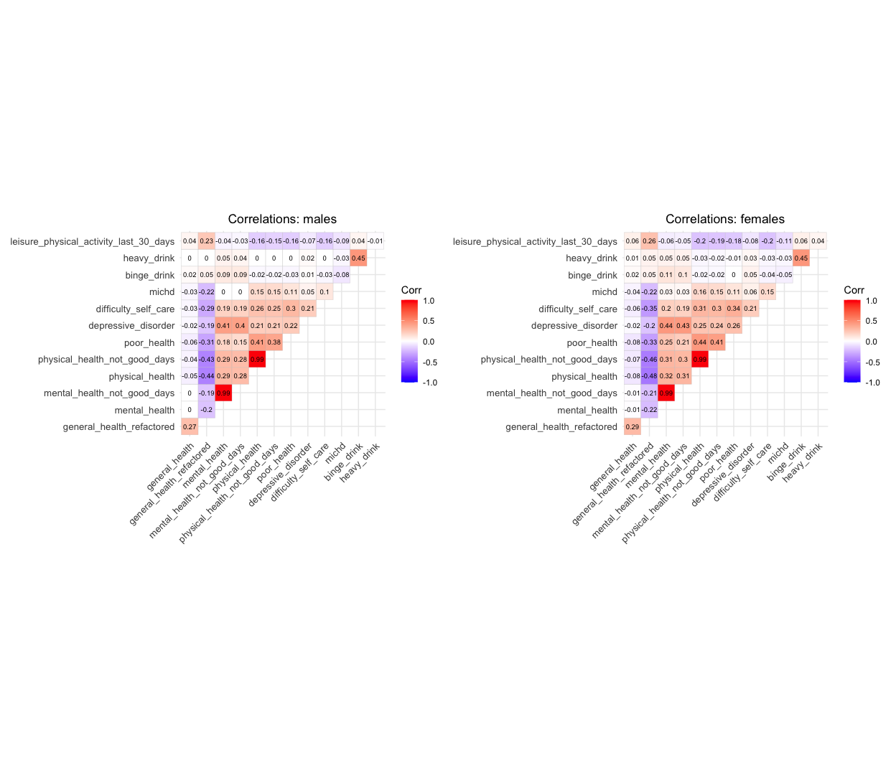
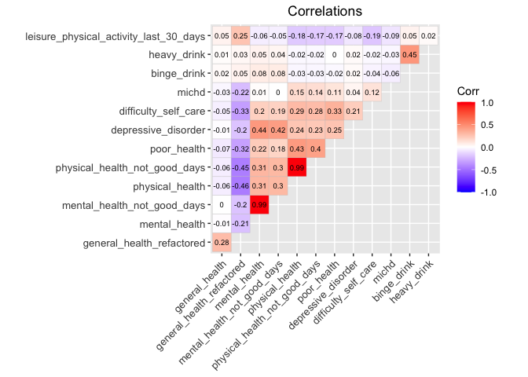
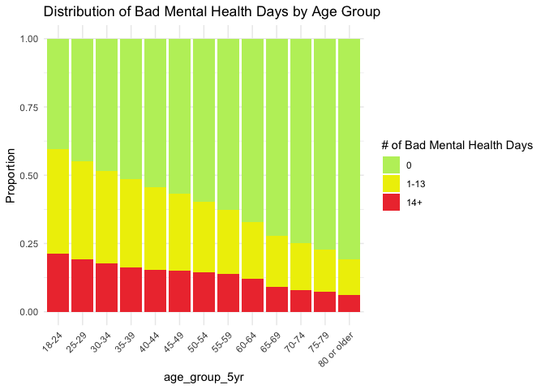
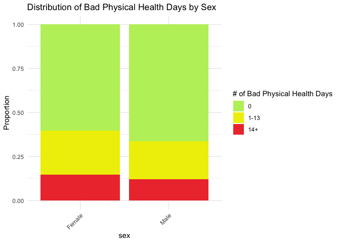
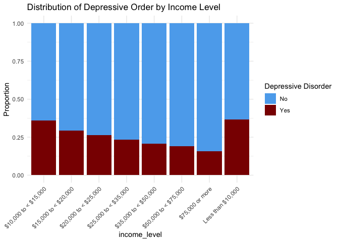
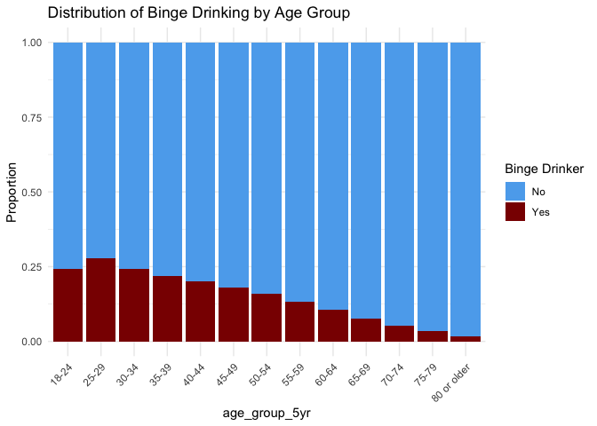

Angelica sections
================
Angelica Bailey
2025-11-29

``` r
knitr::opts_chunk$set(echo = TRUE, collapse = TRUE)
library(tidyverse)
library(ggcorrplot)
library(patchwork)
source(here::here("source", "load_clean_brfss.R"))

brfss_data = load_clean_brfss(here::here("data", "brfss_clean_2017_2024.csv"))
```

# 1. Motivation

### Provide an overview of the project goals and motivation.

# 2. Related work

### Anything that inspired you, such as a paper, a web site, or something we discussed in class.

# 3. Initial questions

### What questions are you trying to answer? How did these questions evolve over the course of the project? What new questions did you consider in the course of your analysis?

# 4. Data

### Source, scraping method, cleaning, etc.

# 5. Exploratory analysis

### Visualizations, summaries, and exploratory statistical analyses. Justify the steps you took, and show any major changes to your ideas.

##### Correlation Analysis

To understand relationships among the health outcome variables in the
BRFSS dataset, we conducted a correlation analysis. Initially, we
computed separate correlation matrices for males and females to assess
whether the relationships among health outcomes differed meaningfully by
sex. For each group, we selected potential key health variables:

``` r
#selecting variables
correlation_vars = c("general_health","general_health_refactored", 
                     "mental_health", "mental_health_not_good_days",
                     "physical_health", "physical_health_not_good_days",
                     "poor_health", "depressive_disorder",
                     "difficulty_self_care", "michd",
                     "binge_drink", "heavy_drink", 
                     "leisure_physical_activity_last_30_days")


#stratifying datasets by sex
brfss_males = brfss_data |>
  filter(sex == "Male") |>
  select(all_of(correlation_vars)) |> 
  mutate_all(as.numeric)

brfss_females = brfss_data |>
  filter(sex == "Female") |>
  select(all_of(correlation_vars)) |> 
  mutate_all(as.numeric)
```

``` r
corr_males = 
  cor(brfss_males, 
      method = "spearman",
      use = "pairwise.complete.obs") |> 
  ggcorrplot(
    type = "upper",  
    method = "square", 
    lab = TRUE,               
    lab_size = 2.5,
    tl.cex = 10,
    title = "Correlations: males") +
  theme(plot.title = element_text(hjust = 0.5))
  
corr_females =
  cor(brfss_females,
      method = "spearman",
      use = "pairwise.complete.obs") |> 
  ggcorrplot(
    type = "upper",
    method = "square",
    lab = TRUE,
    lab_size = 2.5,
    tl.cex = 10,
    title = "Correlations: females") +
  theme(plot.title = element_text(hjust = 0.5))

corr_males + corr_females
```

<!-- -->

Overall, the patterns of association between variables were highly
similar across sexes with no meaningfully different direction or
magnitude of correlations. Because stratification did not reveal
significant differences, we proceeded to perform correlation analysis
without stratification.

``` r
brfss_all = brfss_data |> 
  select(all_of(correlation_vars)) |> 
  mutate_all(as.numeric)

cor(brfss_all, 
      method = "spearman",
      use = "pairwise.complete.obs") |> 
  ggcorrplot(
    type = "upper",
    method = "square",
    lab = TRUE,
    lab_size = 2.5,
    tl.cex = 10,
    title = "Correlations",
    theme(plot.title = element_text(hjust = 0.5))
  )
```

<!-- -->

The correlation matrix revealed redundancy with pairs of variables,
e.g., `mental_health` vs. `mental_health_not_good_days` (r = 0.99).
Including both variables in regression models would introduce
multicollinearity, so one variable from each pair was selected.

We can see that `depressive_disorder` showed the strongest positive
correlation with `mental_health`(r = 0.44). `poor_health` showed a
similar pattern correlating the strongest with `physical_health` (r =
0.43). These trends may reflect how individuals reporting depressive
symptoms or more days where poor health negatively impacted usual
activities also tend to report more poor physical and mental health
days.

On the other hand, `heavy_drink` and `binge_drink` showed weak
correlations with most other health outcomes.

\*`general_health_refactored` shows negative correlations with variables
like `physical_health` and `mental_health`. As general health gets
better (lower score), the number of bad health days goes up (?) This is
an unexpected result.

##### Distribution of primary health outcomes by demographic variables

We explored how our primary health outcomes were distributed across
demographic and socioeconomic groups. We used
`mental_health_not_good_days`, `physical_health_not_good_days`,
`depressive_disorder`, and `binge_drink` based on the consistent
availability of these health outcomes across 2017-2024. Before plotting,
we ordered the factor levels of some demographic variables to ensure
categories appeared in a meaningful sequence in the visualizations.

We used stacked bar plots to visualize these distributions with each bar
representing a demographic category, and the bar divided into segments
to show the proportion of individuals falling into each health outcome.
We used proportions instead of raw counts since the demographic groups
differ in size within the BRFSS dataset.

To efficiently visualize the distribution of these health outcome across
any demographic variable, we constructed a set of plotting functions for
each outcome. For example, for `mental_health_not_good_days`:

``` r
#Bad mental health days outcome
plot_mental_health = function(demo_var, plot_title) {
  
    brfss_data |> 
    filter(
      !is.na(.data[[demo_var]]),
      !is.na(mental_health_not_good_days)
    ) |> 
  
  ggplot(aes(x = .data[[demo_var]], fill = mental_health_not_good_days)) +
    geom_bar(position = "fill") +
    scale_fill_manual(
    values = c(
      "0" = "darkolivegreen2",
      "1-13" = "yellow2",
      "14+" = "brown2"
    ),
    name = "# of Bad Mental Health Days"
  ) +
    labs(
      x = demo_var,
      y = "Proportion",
      title = plot_title
    ) +
    theme_minimal() +
    theme(axis.text.x = element_text(angle = 45, hjust = 1))
  
}

#Bad physical health days outcome
plot_physical_health = function(brfss_data, demo_var, plot_title) {
  
    brfss_data |> 
    drop_na(physical_health_not_good_days) |> 
    drop_na(.data[[demo_var]]) |> 
  
  ggplot(aes(x = .data[[demo_var]], fill = physical_health_not_good_days)) +
    geom_bar(position = "fill") +
    scale_fill_manual(
    values = c(
      "0" = "darkolivegreen2",
      "1-13" = "yellow2",
      "14+" = "brown2"
    ),
    name = "# of Bad Physical Health Days"
  ) +
    labs(
      x = demo_var,
      y = "Proportion",
      title = plot_title
    ) +
    theme_minimal() +
    theme(axis.text.x = element_text(angle = 45, hjust = 1))
  
}

#Depressive disorder outcome
plot_depression = function(demo_var, plot_title) {
  
    brfss_data |> 
    drop_na(depressive_disorder) |> 
    drop_na(.data[[demo_var]]) |> 
  
  ggplot(aes(x = .data[[demo_var]], fill = depressive_disorder)) +
    geom_bar(position = "fill") +
    scale_fill_manual(
    values = c(
      "No" = "steelblue2",
      "Yes" = "red4"
    ),
    name = "Depressive Disorder"
  ) +
    labs(
      x = demo_var,
      y = "Proportion",
      title = plot_title
    ) +
    theme_minimal() +
    theme(axis.text.x = element_text(angle = 45, hjust = 1))
}

#Binge drinker outcome
plot_bingedrink = function(demo_var, plot_title) {
  
    brfss_data |> 
    drop_na(binge_drink) |> 
    drop_na(.data[[demo_var]]) |> 
  
  ggplot(aes(x = .data[[demo_var]], fill = binge_drink)) +
    geom_bar(position = "fill") +
    scale_fill_manual(
    values = c(
      "No" = "steelblue2",
      "Yes" = "red4"
    ),
    name = "Binge Drinker"
  ) +
    labs(
      x = demo_var,
      y = "Proportion",
      title = plot_title
    ) +
    theme_minimal() +
    theme(axis.text.x = element_text(angle = 45, hjust = 1))
}
```

Notable findings:

Looking at the distribution of bad mental health days by age group:

``` r
plot_mental_health(
  demo_var = "age_group_5yr",
  plot_title = "Distribution of Bad Mental Health Days by Age Group"
)
```

<!-- -->

The 18-24 and 25-29 age groups have the largest proportion of
individuals reporting 1-13 and 14+ bad mental health days. Younger
adults experience the highest frequency of bad mental health days, while
older adults report the lowest.

Looking at the distribution of bad physical health days by sex:

``` r
plot_physical_health(
  brfss_data,
  demo_var = "sex",
  plot_title = "Distribution of Bad Physical Health Days by Sex"
)
## Warning: Use of .data in tidyselect expressions was deprecated in tidyselect 1.2.0.
## ℹ Please use `all_of(var)` (or `any_of(var)`) instead of `.data[[var]]`
## This warning is displayed once every 8 hours.
## Call `lifecycle::last_lifecycle_warnings()` to see where this warning was
## generated.
```

<!-- -->

We can see that overall distributions are very similar across males and
females. The proportion reporting 14+ days is relatively small and
nearly identical between sexes. The similarity in patterns can show that
sex differences are unlikely to significantly confound associations
unless interacting with age or other factors.

Distribution of Depressive order by Income Level

``` r
plot_depression(
  demo_var = "income_level",
  plot_title = "Distribution of Depressive Order by Income Level"
)
```

<!-- -->

The lowest-income groups (less than \$10,000 and \$10,000–\<\$15,000)
have the highest proportions of individuals reporting a depressive
disorder. As income decreases, the proportion of respondents with
depressive disorder increases.

Distribution of Binge drinking by Age Group

``` r
plot_bingedrink(
  demo_var = "age_group_5yr",
  plot_title = "Distribution of Binge Drinking by Age Group"
)
```

<!-- -->

We can see that binge drinking is most common among younger adults with
the peak in the 25-29 age group. It steadily declines as age increases.
