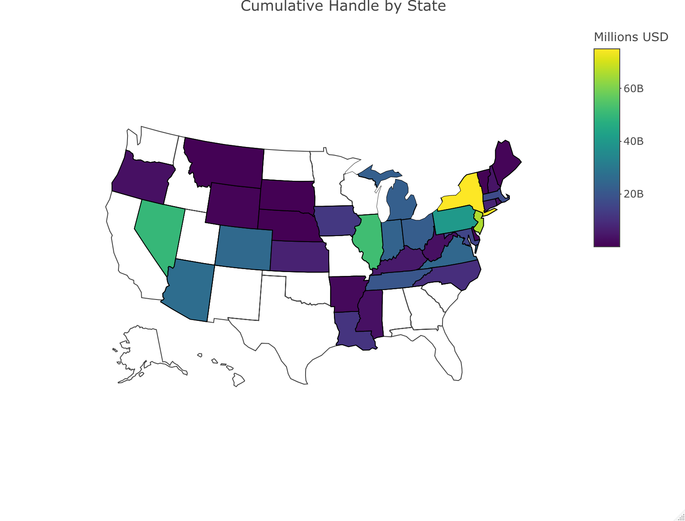

```{r setup, message=FALSE}
knitr::opts_chunk$set(echo = TRUE, collapse = TRUE)
library(tidyverse)
library(haven)
library(lubridate)
library(here)
library(plotly)

# Load your custom functions
source(here("source", "filter_brfss_data.R"))
source(here("source", "standardize_brfss_variable.R"))
source(here("source", "load_clean_brfss.R"))

brfss_data = load_clean_brfss(here("data", "brfss_clean_2017_2024.csv.zip"))
state_fips = read_csv(here("data", "legal_sports_report", "state_fips.csv"))

sb_rev_by_month = read_csv(here("data", "legal_sports_report", "sb_rev_by_month.csv"))
years_in_data = unique(year(pull(sb_rev_by_month, month)))

sb_rev_by_state_month = read_csv(here("data", "legal_sports_report",'sb_rev_by_state_month.csv'))
sb_rev_by_state = read_csv(here("data", "legal_sports_report", "sb_rev_by_state.csv"))
state_legal_dates = read_csv(here("data", "legal_sports_report", 'state_legalization_dates.csv'))

state_pop = read_csv(here("data", "state_population_census.csv"))
```

# 1. Motivation
#### Provide an overview of the project goals and motivation.

# 2. Related work
Anything that inspired you, such as a paper, a web site, or something we discussed in class.

# 3. Initial questions
#### What questions are you trying to answer? How did these questions evolve over the course of the project? What new questions did you consider in the course of your analysis?

# 4. Data
#### Source, scraping method, cleaning, etc.

##### Source
For information on sports betting we scraped data from [Legal Sports Report](https://www.legalsportsreport.com/sports-betting-states/revenue/) and manually pulled the dates of legalization (for both retail and online) from the [American Gaming Association](https://www.americangaming.org/research/state-of-play-map/)

##### Scraping Method
The code to scrape Legal Sports Report is in `get_sports_betting_data.R`. The process was straightforward, with two summary tables at the top and separate tables for each state below. We pulled all html tables and iterated through the state headers to aggregate data for all states. There were a few states with no data (Florida, New Mexico, North Dakota, Washington, and Wisconsin).
 
# 5. Exploratory analysis
#### Visualizations, summaries, and exploratory statistical analyses. Justify the steps you took, and show any major changes to your ideas.

##### Total Handle and Number of States with Legal Sports Betting

```{r}
get_n_states_legal = function(input_month) {
  n_states_legal = nrow(filter(state_legal_dates, first_start <= input_month))
}

sb_rev_by_month = sb_rev_by_month |> 
  mutate(
    n_states_legal = sapply(month, get_n_states_legal)
  ) 

scale_factor = max(pull(sb_rev_by_month,n_states_legal)) / max(pull(sb_rev_by_month,handle))

sb_rev_by_month |> 
  ggplot(aes(x = month)) +
  geom_line(aes(y=handle, color="handle")) +
  geom_line(aes(y=n_states_legal / scale_factor, color="legal")) +
  scale_y_continuous(
    name = "Handle ($)",
    sec.axis = sec_axis(~ . * scale_factor, name="States Legal")
  ) +
  #scale_color_(name = NULL) +
  scale_color_discrete(name = NULL, labels = c("handle" = "Total Handle", "legal" = "n States Legal")) +
  labs(
    title = "Total Sports Handle and Number of States with Legal Sports Betting",
    x = "Date"
  ) +
  theme_minimal()
```

##### Cumulative Handle by State

This code uses plotly, which doesn't render to github document. There is a static image with no interactivity:

```{r eval=FALSE}
sb_rev_by_state = sb_rev_by_state |> 
  filter(market != "Total") |> 
  left_join(state_fips, join_by(market == state)) |> 
  left_join(
    select(state_legal_dates, state, first_start, online, offline), 
    join_by(market == state)) |> 
  mutate(
    legal_type = case_when(
      !is.na(online) & !is.na(offline) ~ "both",
      !is.na(offline) ~ "offline",
      !is.na(online) ~"online"
    )
  ) |> 
  mutate(
    hover = paste("<b>",market,"</b>", '<br>', 
                  "Handle: $", format(handle / 1000000000, digits = 2), "B", "<br>", 
                  "Revenue: $", format(revenue / 100000000, digits = 2), "M", "<br>",
                  "Hold: ", hold, '%<br>', 
                  "Taxes: ", format(taxes / 100000000, digits = 2), "M",
                  "<extra></extra>")
    )
                      
# give state boundaries a white border
l = list(color = toRGB("white"), width = 2)

# specify some map projection/options
g = list(
  scope = 'usa',
  projection = list(type = 'albers usa'),
  showlakes = TRUE,
  lakecolor = toRGB('white')
)

fig = plot_geo(sb_rev_by_state, locationmode = 'USA-states')
fig = fig |> 
  add_trace(
    z = ~handle, hovertemplate = ~hover, #text = ~hover, 
    locations = ~abbr,
    color = ~handle, colorscale="Viridis"
  ) |> 
  colorbar(title = "Millions USD") |> 
  layout(
    title = 'Cumulative Handle by State', #<br>(Hover for breakdown)',
    geo = g
  )

fig
```




##### Handle by State in 2024

```{r}
sb_rev_by_state_month |> 
  mutate(year = year(month)) |>   # Extract year
  group_by(state, year) |>        # Group by year
  summarize(
    total_handle = sum(handle, na.rm = TRUE),
  ) |> 
  filter(year == 2024) |> 
  ungroup() |> 
  mutate(
    state = fct_reorder(state, total_handle)
  ) |> 
  ggplot(aes(x=state, y= total_handle)) +
  coord_flip() +
  geom_bar(stat="identity") +
  labs(
    title = "Sports Betting Handle by State in 2024",
    x = "State",
    y = "Handle ($)"
  ) +
  theme_minimal()
```
We can see New York has the highest handle which makes sense since it is the most populous state. We can get a sense of the popularity of sports gambling by looking at total handle per capita using US census data for total population by state.

##### Handle by State per Capita in 2024

```{r}
sb_rev_by_state_month |> 
  mutate(year = year(month)) |>  
  group_by(state, year) |>                 
  summarize(
    total_handle = sum(handle, na.rm = TRUE),
  ) |> 
  filter(year == 2024) |> 
  ungroup() |> 
  left_join(select(state_pop, state, "2024"), by = "state") |> 
  rename(population_2024 = '2024') |> 
  mutate(
    handle_per_capita = total_handle / population_2024,
    state = fct_reorder(state, handle_per_capita)
  ) |> 
  ggplot(aes(x=state, y= handle_per_capita)) +
  coord_flip() +
  geom_bar(stat="identity") +
  labs(
    title = "Sports Betting Handle per Capita in 2024",
    x = "State",
    y = "Handle ($) per capita"
  ) +
  theme_minimal()
```
We can see that Nevada and New Jersey have the highest handle per capita.

# 6. Additional analysis
#### If you undertake formal statistical analyses, describe these in detail


#### Linear Regression on any bad mental health days

```{r}
brfss_data = load_clean_brfss(here::here("data", "brfss_clean_2017_2024.csv.zip")) |> 
  mutate(
    month = lubridate::floor_date(date, unit = "month")
 )
```

Filter age group < 55 (and sports betting legal)

```{r}
brfss_age_data = brfss_data |> 
  filter(
    age_group_5yr %in% 
      c("18-24","25-29","30-34","35-39","40-44","45-49","50-54"),
    sb_legal %in% c(0, 1)) #,
    
    #year(date) < 2020)
```

We used a linear regression model to look at the effect of legalized sports betting on any bad mental health days, and the interaction between sex and age.

```{r}
fit =  lm(any_mental_health_not_good_days ~ sex + age_group_5yr + sb_legal 
                             + sex * sb_legal 
                             + age_group_5yr * sb_legal, data = brfss_age_data) 
fit_result = fit |> 
  broom::tidy() |> 
  select(term, estimate, std.error, p.value)

fit_result |> 
  knitr::kable(digits = 3)
```

##### Baseline differences in mental health
Sex: Men have a `r select(filter(fit_result, term=='sexMale'), estimate)*-100` percentage point lower probability of reporting ≥1 mentally unhealthy day compared to women (p < 0.001).

Age: All age coefficients are negative, meaning older groups report fewer mentally unhealthy days than 18–24-year-olds.

This matches known demographic patterns typical in BRFSS mental health data.

##### Overall effect of sports betting legality (sb_legal)
Main effect: sb_legal = 0.054 `r select(filter(fit_result, term=='sb_legal'), estimate)`(p < 0.001)

In the reference group (female, age 18–24), living in a state where sports betting is legal is associated with a +5.4 `r select(filter(fit_result, term=='sb_legal'), estimate)*100` percentage point higher probability of reporting ≥1 mentally unhealthy day in the past month.

##### Does the effect differ by sex?
Interaction: sexMale × sb_legal = -0.001 `r select(filter(fit_result, term=='sexMale:sb_legal'), estimate)` (p = 0.588 `r select(filter(fit_result, term=='sexMale:sb_legal'), p.value)`) 

There is no meaningful difference in the effect of sports betting legalization between men and women.
The coefficient is tiny (–0.1 percentage points) and not statistically significant.

##### Differences by age group

Each age interaction term tells us how much the effect of sports betting legality differs from the reference group (18–24).

```{r}
fit_result |> 
  filter(str_starts(term, "age_group_") & str_ends(term, "sb_legal")) |> 
  select(term, estimate, p.value) |> 
  mutate(
    term = str_replace_all(term, c("age_group_5yr"="", ":sb_legal"=""))
  ) |> 
  rename("Age Group" = term) |> 
  knitr::kable()
```
The effect is largest for adults 25-29 (`r select(filter(fit_result, term=='age_group_5yr25-29:sb_legal'), estimate)`) and not significant for adults 45-49 and 50-54.

The impact of sports betting legalization on mentally unhealthy days appears stronger for younger adults (25–44) but then plateaus.

##### Overall Conclusions:

* After adjusting for sex and age, living in a state with legal sports betting is associated with higher probability of having mentally unhealthy days, especially among adults aged 25–44.
* The effect size is around 5–8 percentage points, depending on age group.
* Men and women are affected similarly.
* Younger adults (18–24) have the highest baseline mental health risk, but legalization effects are somewhat stronger for those 25–44.
* These associations cannot establish causality (due to cross-sectional BRFSS data), but they indicate a robust correlation.

#### Predicted Probability of ≥1 Mentally Unhealthy Day

```{r}
# Build prediction grid
pred_df = expand.grid(
  sex = c("Female", "Male"),
  age_group_5yr = c("18-24","25-29","30-34","35-39","40-44","45-49","50-54"),
  sb_legal = c(0, 1)   # illegal = 0, legal = 1
)

# Get predicted probabilities and plot
pred_df |> 
  mutate(pred_prob = predict(fit, newdata = pred_df)) |> 
  ggplot(aes(x = age_group_5yr, y = pred_prob,
                    color = interaction(sex, sb_legal),
                    group = interaction(sex, sb_legal),
                    linetype = factor(sb_legal))) +
  geom_line(size = 1.1) +
  scale_color_manual(
    name = "",
    values = c(
      "Female.0" = "#AA336A",  # orange solid
      "Female.1" = "#DE3163",  # blue dashed
      "Male.0"   = "#4682B4",  # green solid
      "Male.1"   = "#0F52BA"   # blue dashed
    ),
    labels = c(
      "Female.0" = "Female - SB illegal",
      "Female.1" = "Female - SB legal",
      "Male.0"   = "Male - SB illegal",
      "Male.1"   = "Male - SB legal"
    )
  ) +
  scale_linetype_manual(
    name = "",
    values = c("0" = "solid", "1" = "dashed"),
    labels = c("0" = "SB illegal", "1" = "SB legal")
  ) +
  labs(
    x = "Age Group",
    y = "Predicted Probability",
    title = "Predicted Probability of ≥1 Mentally Unhealthy Day",
    subtitle = "Interaction: Age × Sex × Sports Betting Legalization"
  ) +
  theme_minimal(base_size = 14) +
  theme(
    legend.position = "right",
    axis.text.x = element_text(angle = 45, hjust = 1)
  )
```

The graph shows how the predicted probability of reporting at least one mentally unhealthy day in the past month varies across age groups, sex, and whether sports betting is legal in the respondent’s state.

 * Baseline trends:
    - When sports betting is not legal, women consistently report higher rates of mentally unhealthy days than men across all age groups.
    - Both sexes show a steady decline in mentally unhealthy days as age increases, with 18–24-year-olds exhibiting the highest risk and 50–54-year-olds the lowest.
 * Effect of sports betting legalization:
    - Across nearly all age groups, the dashed lines (SB legal) lie above the corresponding solid lines (SB illegal) which means sports betting legalization is associated with a higher probability of reporting mentally unhealthy days.
    - The size of this increase varies by age
    - The difference is largest among young and early-mid adults, especially ages 25–44.
* Differences between men and women
    - The vertical distance between male and female lines remains fairly constant regardless of legalization status, which indicates women consistently report more mentally unhealthy days than men.
    - The effect of sports betting legalization is similar for both sexes (supports the non-significant sex × legalization interaction in the model).
* Age × legalization interaction
    - The graph visually confirms the pattern in the coefficients:
    - Among younger adults (25–44), the increase associated with sports betting legalization is noticeably larger.
    - By 45–54, the effect is small or negligible.
    - This suggests that younger and mid-age adults may be more sensitive to environmental or policy changes related to gambling or these age groups may participate more in gambling or be more exposed to advertising or technology that connects them to sports betting markets.

Sports betting legalization is associated with a higher probability of experiencing mentally unhealthy days, especially among adults aged 25–44, and this pattern is similar for both men and women.
The effect does not appear uniform across age groups, indicating a meaningful age × policy interaction.


# 7. Discussion
#### What were your findings? Are they what you expect? What insights into the data can you make?