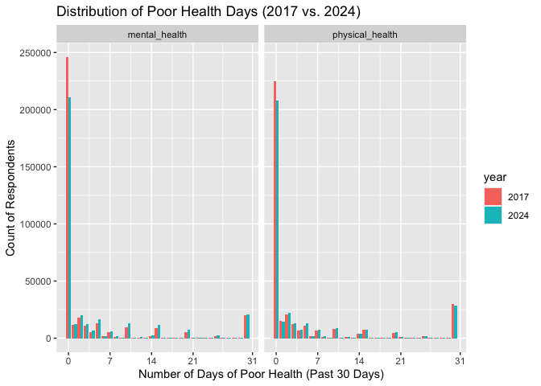
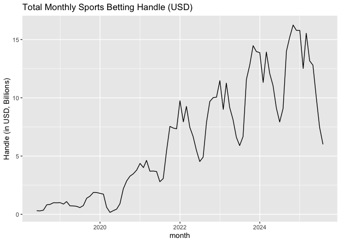
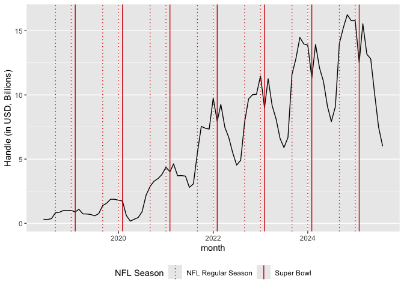
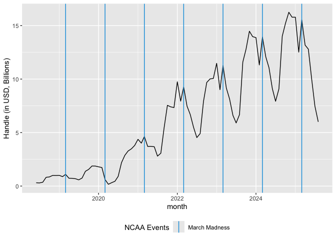
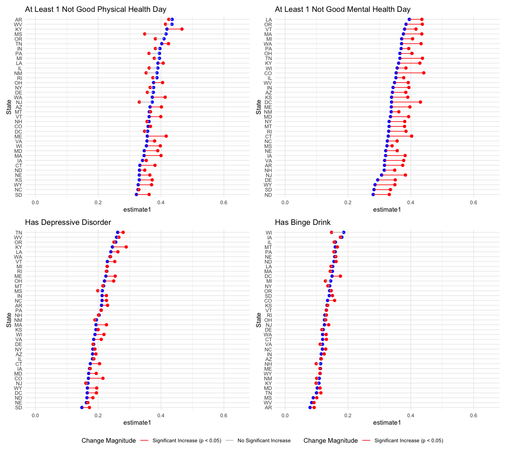
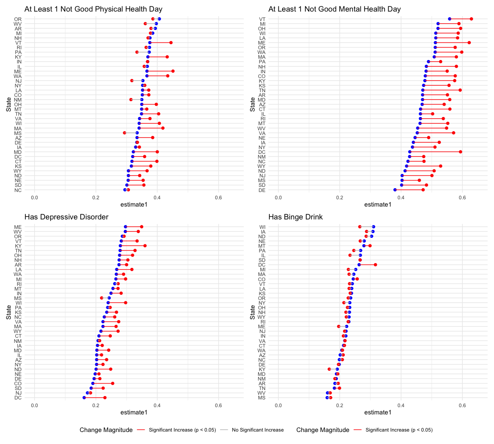

Shivalika sections
================
Shivalika Chavan
2025-11-28

``` r
knitr::opts_chunk$set(echo = TRUE, collapse = TRUE)
library(tidyverse)
```

    ## ── Attaching core tidyverse packages ──────────────────────── tidyverse 2.0.0 ──
    ## ✔ dplyr     1.1.4     ✔ readr     2.1.5
    ## ✔ forcats   1.0.0     ✔ stringr   1.5.1
    ## ✔ ggplot2   3.5.2     ✔ tibble    3.3.0
    ## ✔ lubridate 1.9.4     ✔ tidyr     1.3.1
    ## ✔ purrr     1.1.0     
    ## ── Conflicts ────────────────────────────────────────── tidyverse_conflicts() ──
    ## ✖ dplyr::filter() masks stats::filter()
    ## ✖ dplyr::lag()    masks stats::lag()
    ## ℹ Use the conflicted package (<http://conflicted.r-lib.org/>) to force all conflicts to become errors

``` r
library(haven)
library(lubridate)
library(here)
```

    ## here() starts at /Users/shivalikachavan/Documents/School/AU 2025/P8105 - Data Science I/Projects/Final/p8105_final

``` r
library(patchwork)
library(epitools)

source(here("source", "filter_brfss_data.R"))
source(here("source", "standardize_brfss_variable.R"))
source(here("source", "prop_test_functions.R"))
source(here("source", "run_fishers_test.R"))
source(here("source", "load_clean_brfss.R"))

brfss_data = load_clean_brfss(here("data", "brfss_clean_2017_2024.csv.zip"))
```

    ## Rows: 37 Columns: 6
    ## ── Column specification ────────────────────────────────────────────────────────
    ## Delimiter: ","
    ## chr  (2): state, abbr
    ## dbl  (1): fips
    ## date (3): first_start, online, offline
    ## 
    ## ℹ Use `spec()` to retrieve the full column specification for this data.
    ## ℹ Specify the column types or set `show_col_types = FALSE` to quiet this message.
    ## Multiple files in zip: reading 'brfss_clean_2017_2024.csv'
    ## Rows: 2749477 Columns: 39
    ## ── Column specification ────────────────────────────────────────────────────────
    ## Delimiter: ","
    ## chr   (2): imonth, iday
    ## dbl  (36): qstver, dispcode, state, seqno, iyear, sex, marital, educag, empl...
    ## date  (1): date
    ## 
    ## ℹ Use `spec()` to retrieve the full column specification for this data.
    ## ℹ Specify the column types or set `show_col_types = FALSE` to quiet this message.

``` r
state_fips = read_csv(here("data", "legal_sports_report", "state_fips.csv"))
```

    ## Rows: 53 Columns: 3
    ## ── Column specification ────────────────────────────────────────────────────────
    ## Delimiter: ","
    ## chr (2): state, abbr
    ## dbl (1): fips
    ## 
    ## ℹ Use `spec()` to retrieve the full column specification for this data.
    ## ℹ Specify the column types or set `show_col_types = FALSE` to quiet this message.

``` r
sb_rev_by_month = read_csv(here("data", "legal_sports_report", "sb_rev_by_month.csv"))
```

    ## Rows: 87 Columns: 5
    ## ── Column specification ────────────────────────────────────────────────────────
    ## Delimiter: ","
    ## dbl  (4): handle, revenue, hold, taxes
    ## date (1): month
    ## 
    ## ℹ Use `spec()` to retrieve the full column specification for this data.
    ## ℹ Specify the column types or set `show_col_types = FALSE` to quiet this message.

``` r
years_in_data = unique(year(pull(sb_rev_by_month, month)))

outcome_vars = c("any_physical_health_not_good_days", "any_mental_health_not_good_days", "has_depressive_disorder", "has_binge_drink")
```

# 1. Motivation

#### Provide an overview of the project goals and motivation.

# 2. Related work

Anything that inspired you, such as a paper, a web site, or something we
discussed in class.

# 3. Initial questions

#### What questions are you trying to answer? How did these questions evolve over the course of the project? What new questions did you consider in the course of your analysis?

# 4. Data

#### Source, scraping method, cleaning, etc.

##### Source

Our primary data source for health outcomes is the Behavioral Risk
Factor Surveillance System (BRFSS), an annual, state-based, telephone
survey conducted by the CDC. We looked at all completed interviews
between 2017 and 2024 (that were publicly available as of early November
2025). We chose this period as it spans the period before the Supreme
Court ruling in 2018, which allowed many states to legalize sports
betting. Our final dataset contained approximately 2.75 million
completed interviews across all years.

##### Cleaning

Across the years, there have been many iterations of the BRFSS survey,
in terms of variable coding and questions asked. As a result, extensive
cleaning and standardization was required. This process was handled with
several `source` files. More detailed explanations of this process are
available in `brfss_data_exploration.Rmd` and `brfss_data_cleaning.Rmd`.

- `standardize_brfss_variable.R`: This function renames variables that
  have more than one version of the same variable (e.g. `HLTHPL1` and
  `HLTHPL2`). Seeing that the variables differed in name only (the
  responses were coded in the same way), this was handled by renaming
  different versions to the single standardized name.
  (e.g. `hlthpl_standard`).
- `filter_brfss_data.R`: This function keeps the key variables for our
  study (unique survey identifiers, demographic/predictor variables,
  health/financial outcomes variables). It also filters for completed
  interviews (`dispcode = 1100`) and converts the date of the interview
  to a Date type variable.
- `load_clean_brfss_data.R`: This function is used to load the cleaned
  data set into R by recoding variables (e.g. `1 ~ "Male"`), and
  connects the date of each interview to the status of legalization in
  that state. This `sb_legal` treatment variable is added by merging
  with `state_legalization_dates.csv`.

Our analyses focuses on the following cleaned variable groups:

- Treatment Variable: `sb_legal` (`1` if the interview was conducted
  after the state legalized sports betting (rounded to the first of the
  motnh), `0` if it was before, and `NA` if the state has yet to
  legalize sport betting)
- Outcome Variables: `mental_health_not_good_days`,
  `physical_health_not_good_days`, `depressive_disorder`, and
  `binge_drink`. In some cases, a binary version of these variables was
  used (1 if the participant has the outcome, 0 if not).
- Predictors: any demographic variables (sex, age group, education
  level, etc.)

# 5. Exploratory analysis

#### Visualizations, summaries, and exploratory statistical analyses. Justify the steps you took, and show any major changes to your ideas.

##### Data Completeness

One of our primary concerns with data was ensuring that the key outcome
variables were reported consistently from 2017 to 2024.

``` r
all_outcome_vars = c("general_health", "general_health_refactored", "michd",
                 "physical_health", "physical_health_not_good_days", "leisure_physical_activity_last_30_days",
                 "mental_health", "mental_health_not_good_days", "poor_health", "depressive_disorder",
                 "difficulty_self_care", "life_satisfaction", "emotional_support", "loneliness", "binge_drink",
                 "heavy_drink", "lost_reduced_employment", "financial_strain_bills", "financial_strain_utilities")

summarize_outcome_by_year = function(outcome_var, df = brfss_data) {
  
  outcome_sym = rlang::sym(outcome_var) 
  
  df |> 
    group_by(year(date), !!outcome_sym) |> 
    summarize(n = n(), .groups = "drop") |> 
    pivot_wider(
      names_from = `year(date)`, 
      values_from = n
    )
}

find_complete_years = function(outcome_var, summary_df){
  
  outcome_sym = rlang::sym(outcome_var) 
  
  summary_df |> 
    filter(!is.na(!!outcome_sym)) |> 
    summarize(
      across(
        .cols = everything(),
        .fns = ~ !all(is.na(.x)) 
        )
      )|>
    select(-!!outcome_sym) |> 
    pivot_longer(
      cols = everything(),
      names_to = "year",
      values_to = "is_complete"
      ) |> 
    summarize(
      n_complete_years = sum(is_complete)
      ) |> 
    pull(n_complete_years)
    
}

complete_outcomes = tibble(
  outcome = all_outcome_vars,
  summary = map(all_outcome_vars, summarize_outcome_by_year),
  n_complete_years = map2(all_outcome_vars, summary, find_complete_years)
  ) |> 
  arrange(n_complete_years) |> 
  filter(
    n_complete_years == 8
  ) |> 
  pull(outcome)

setdiff(all_outcome_vars, complete_outcomes)
## [1] "life_satisfaction"          "emotional_support"         
## [3] "loneliness"                 "lost_reduced_employment"   
## [5] "financial_strain_bills"     "financial_strain_utilities"
```

Some of the outcome variables we were interested in looking at like
financial strain, were not available in all years. In order to maintain
a robust analysis over time, we were limited to those variables that
were available over all years. Our 4 primary outcomes are available over
all years.

##### Distribution of Key Outcomes + Rationale for Binary Outcomes

``` r
brfss_data |>
  filter(year(date) %in% c(2017, 2024)) |>
  select(year = date, mental_health, physical_health) |>
  mutate(
    year = factor(year(year)),
    mental_health = ifelse(mental_health > 30, 31, mental_health), 
    physical_health = ifelse(physical_health > 30, 31, physical_health)
  ) |>
  pivot_longer(
    cols = c(mental_health, physical_health),
    names_to = "outcome",
    values_to = "n_bad_days"
  ) |>
  ggplot(aes(x = n_bad_days, fill = year)) +
  geom_bar(position = "dodge") +
  scale_x_continuous(breaks = c(0, 7, 14, 21, 31), labels = c(0, 7, 14, 21, 31)) +
  facet_wrap(~outcome) +
  labs(
    title = "Distribution of Poor Health Days (2017 vs. 2024)",
    x = "Number of Days of Poor Health (Past 30 Days)",
    y = "Count of Respondents"
  )
## Warning: Removed 27288 rows containing non-finite outside the scale range
## (`stat_count()`).
```

<!-- -->

Given the concentration of responses at 0 days, we decided to use a
binary outcome variable like `any_physical_health_not_good_days` as the
outcome variable. This also follows what Couture, et. al. used in their
analysis. It also simplified statistical tests that we decided to do
later on.

##### Understanding Spikes in Sports Betting Handle

In addition to the BRFSS survey, we looked at sports betting data (Total
Handle) to understand the cyclic nature of the betting market that could
influence mental health outcomes. The purpose is to determine if the
spikes in betting activity align with major sports seasons.

###### Overall

``` r
sb_rev_by_month |> 
  mutate(handle_B = handle / 1e9) |> 
  ggplot(aes(x = month, y = handle_B)) + 
  geom_line() + 
  ylab("Handle (in USD, Billions)") + 
  labs(title = "Total Monthly Sports Betting Handle (USD)")
```

<!-- -->

The plot clearly shows strong cyclical trends in total handle,
suggesting that the volume of betting is highly sensitive to the sports
calendar.

###### NFL Season

``` r
nfl_event_dates = tibble(
  date = c(
    ymd(paste(years_in_data, "09", "01", sep = "-")),
    ymd(paste(years_in_data, "01", "01", sep = "-")),
    ymd(paste(years_in_data, "02", "01", sep = "-"))
    ),
  
  type = case_when(
    month(date) == 2 ~ "Solid", 
    TRUE ~ "Dotted" 
    ),
  
  label = case_when(
    month(date) == 9 ~ "Start of Season",
    month(date) == 1 ~ "End of Season",
    month(date) == 2 ~ "Super Bowl"
    )
  ) |> 
  filter(date >= min(sb_rev_by_month$month), date <= max(sb_rev_by_month$month))


sb_rev_by_month |>
  mutate(handle_B = handle / 1e9) |>
  ggplot(aes(x = month, y = handle_B)) +
  geom_line() +
  ylab("Handle (in USD, Billions)") +
  geom_vline(
    data = nfl_event_dates,
    aes(xintercept = date, linetype = type),
    color = "#D50A0A",
    show.legend = TRUE 
  ) +
  scale_linetype_manual(
    name = "NFL Season", 
    values = c("Dotted" = "dotted", "Solid" = "solid"), 
    labels = c("Dotted" = "NFL Regular Season", "Solid" = "Super Bowl") 
  ) + 
  theme(legend.position="bottom")
```

<!-- -->

The largest peak in the betting handle clearly coincides with the NFL
regular season in September, and a smaller dip aligns with the season’s
end around the Super Bowl.

###### NCAA March Madness

``` r
ncaa_event_dates = tibble(
  date = c(
    ymd(paste(years_in_data, "03", "01", sep = "-"))
    ),
  
  type = case_when(
    month(date) == 3 ~ "Solid"
    ),
  
  label = case_when(
    month(date) == 3 ~ "March Madness"
    )
  ) |> 
  filter(date >= min(sb_rev_by_month$month), date <= max(sb_rev_by_month$month))


sb_rev_by_month |>
  mutate(handle_B = handle / 1e9) |>
  ggplot(aes(x = month, y = handle_B)) +
  geom_line() +
  ylab("Handle (in USD, Billions)") +
  geom_vline(
    data = ncaa_event_dates,
    aes(xintercept = date, linetype = type),
    color = "#009CDE",
    show.legend = TRUE 
  ) +
  scale_linetype_manual(
    name = "NCAA Events", 
    values = c("Solid" = "solid"), 
    labels = c("Solid" = "March Madness") 
  ) + 
  theme(legend.position="bottom")
```

<!-- -->

A secondary peak in betting handle occurs during March Madness. This is
important because it represents a period of intense, short-term betting
interest.

# 6. Additional analysis

#### If you undertake formal statistical analyses, describe these in detail

To test the relationship between sports betting legalization and health
outcomes, we employed two statistical approaches: a proportion test to
compare the prevalence of adverse outcomes before and after the
legalization of sports betting, and a Fisher’s Exact Test to calculate
the Relative Risk (RR) of these outcomes in states where sports betting
is legal vs. states where it is illegal for the most recent data in
2024. We compared outcome rates in “exposed” (sports betting is legal)
and “unexposed” (sports betting is not legal) populations.

##### Prop Tests

Our one-sided two sample proportion tests are examining whether there is
a significant change (baseline is lower) in the rates of the 4 health
outcomes. In the first test, for example, the null hypothesis is that
the rate of a particular outcome (e.g. binge drinking) is the same in
2017 and in 2024. The alternative is that the rate of binge drinking was
less in 2017 that it was in 2024.

These tests looks at the raw change over time, regardless of when
legalization occurred, providing a general benchmark. The lines show the
change, and the color indicates statistical significance.

``` r
prop_tests_state = 
  brfss_data |> 
  filter(year(date) %in% c(2017, 2024)) |>
  select(state, date, all_of(outcome_vars)) |>
  pivot_longer(
    cols = all_of(outcome_vars),
    names_to = "outcome",
    values_to = "outcome_value" 
    ) |>
  group_by(state, outcome) |>
  nest() |> 
  mutate(test_result = map(data, run_prop_test_state)) |> 
  factor_significant()

combine_plots(prop_tests_state)
```


The second test we wanted to run used each state’s specific legalization
date, `sb_legal`, as the inflection point. We also repeated this test
looking specifically at adults under 50 due to their higher
participation in sports betting.

``` r
prop_tests_sb_legal = 
  brfss_data |> 
  select(state, sb_legal, all_of(outcome_vars)) |>
  pivot_longer(
    cols = all_of(outcome_vars),
    names_to = "outcome",
    values_to = "outcome_value" 
    ) |>
  group_by(state, outcome) |>
  nest() |> 
  mutate(test_result = map(data, run_prop_test_state_legalization)) |> 
  factor_significant()

combine_plots(prop_tests_sb_legal)
```



``` r
prop_tests_sb_legal = 
  brfss_data |> 
  filter(age_group_5yr %in% c("18-24", "25-29", "30-34", "35-39", "40-44", "45-49")) |> 
  select(state, sb_legal, all_of(outcome_vars)) |>
  pivot_longer(
    cols = all_of(outcome_vars),
    names_to = "outcome",
    values_to = "outcome_value" 
    ) |>
  group_by(state, outcome) |>
  nest() |> 
  mutate(test_result = map(data, run_prop_test_state_legalization)) |> 
  factor_significant()

combine_plots(prop_tests_sb_legal)
```



##### Relative Risk of Poor Mental Health Outcomes in Legal vs. Non-Legal states in 2024

According to PEW research, “Young adults are more likely than older
Americans to say they’ve placed a sports bet in the past year.”

We are using the 4 following health outcomes:

- *At least 1 poor mental health day*: “Now thinking about your mental
  health, which includes stress, depression, and problems with emotions,
  for how many days during the past 30 days was your mental health not
  good?”
- *At least 1 poor physical health day*: “Now thinking about your
  physical health, which includes physical illness and injury, for how
  many days during the past 30 days was your physical health not good?”
- *Depression*: “Has a doctor or other health professional ever told you
  that you had a depressive disorder, including depression, major
  depression, dysthymia, or minor depression?”
- *Binge Drinking:* “Considering all alcoholic beverages that you drink,
  on average, how many times per month do you have 5 (for men) or 4 (for
  women) or more drinks on one occasion?”

In 2024, what is the risk of having poor mental health outcomes based on
state legalization?

Exposure: betting legalization

Outcomes: any_physical_health_not_good_days,
any_mental_health_not_good_days, has_depressive_disorder,
has_binge_drink

We opted to use a Fisher’s exact test in the event that one of the
counts happened to be small. The goal of this test is to determine if
there is a statistically significant association between status of
sports betting legalization and the presence of the 4 health outcomes.

``` r
phys_health_results = 
  brfss_data |>
  filter(year(date) == 2024, age_group_5yr %in% c("18-24", "25-29"), !is.na(any_physical_health_not_good_days)) |>
  select(sb_legal, any_physical_health_not_good_days) |> 
  rename(outcome = any_physical_health_not_good_days) |> 
  run_fishers_test()

phys_health_results |> pull(summary) |> knitr::kable()
```

<table class="kable_wrapper">

<tbody>

<tr>

<td>

| sports_betting_legal | outcome_FALSE | outcome_TRUE |
|:---------------------|--------------:|-------------:|
| FALSE                |          6578 |         4186 |
| TRUE                 |         15277 |        10692 |

</td>

</tr>

</tbody>

</table>

``` r

ment_health_results = 
  brfss_data |>
  filter(year(date) == 2024, age_group_5yr %in% c("18-24", "25-29"), !is.na(any_mental_health_not_good_days)) |>
  select(sb_legal, any_mental_health_not_good_days) |> 
  rename(outcome = any_mental_health_not_good_days) |> 
  run_fishers_test()

ment_health_results |> pull(summary) |> knitr::kable()
```

<table class="kable_wrapper">

<tbody>

<tr>

<td>

| sports_betting_legal | outcome_FALSE | outcome_TRUE |
|:---------------------|--------------:|-------------:|
| FALSE                |          4357 |         6384 |
| TRUE                 |          9739 |        16298 |

</td>

</tr>

</tbody>

</table>

``` r

depression_results = 
  brfss_data |>
  filter(year(date) == 2024, age_group_5yr %in% c("18-24", "25-29"), !is.na(has_depressive_disorder)) |>
  select(sb_legal, has_depressive_disorder) |> 
  rename(outcome = has_depressive_disorder) |> 
  run_fishers_test()

depression_results |> pull(summary) |> knitr::kable()
```

<table class="kable_wrapper">

<tbody>

<tr>

<td>

| sports_betting_legal | outcome_FALSE | outcome_TRUE |
|:---------------------|--------------:|-------------:|
| FALSE                |          8050 |         2794 |
| TRUE                 |         18989 |         7211 |

</td>

</tr>

</tbody>

</table>

``` r

binge_drink_results = 
  brfss_data |>
  filter(year(date) == 2024, age_group_5yr %in% c("18-24", "25-29"), !is.na(has_binge_drink)) |>
  select(sb_legal, has_binge_drink) |> 
  rename(outcome = has_binge_drink) |> 
  run_fishers_test()

binge_drink_results |> pull(summary) |> knitr::kable()
```

<table class="kable_wrapper">

<tbody>

<tr>

<td>

| sports_betting_legal | outcome_FALSE | outcome_TRUE |
|:---------------------|--------------:|-------------:|
| FALSE                |          8474 |         2278 |
| TRUE                 |         19721 |         6319 |

</td>

</tr>

</tbody>

</table>

# 7. Discussion

#### What were your findings? Are they what you expect? What insights into the data can you make?

Among BRFSS participants in 2024 between the ages of 18 and 29, those
who resided in states with legalized sports betting had:

- 1.06x risk of having at least 1 day of poor physical health
- 1.05x risk of having at least 1 day of poor mental health
- 1.07x risk of having depression
- 1.15x risk of binge drinking

compared to those residing in states where sports betting is not legal.
Each of these results also show that there is a statistically
significant relationship between the status of sports betting
legalization and health outcomes:

- At least 1 day of poor physical health: 5.08e-05
- At least 1 day of poor mental health: 1.61e-08
- Depression: 5.17e-04
- Binge Drinking: 1.75e-10
