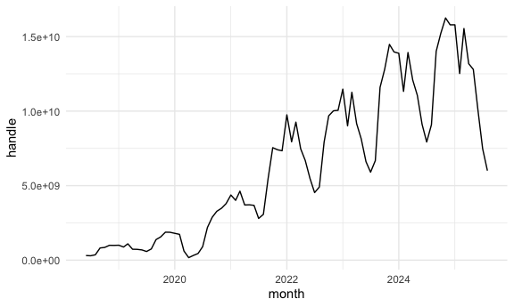
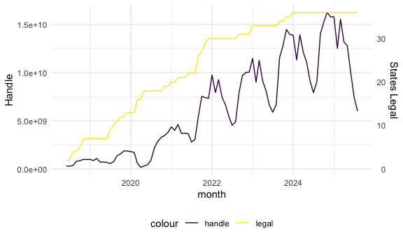

sports betting exploration
================
2025-11-13

## Look at total handle

``` r
sb_rev_month_df = read_csv('./data/legal_sports_report/sb_rev_by_month.csv')
```

    ## Rows: 87 Columns: 5
    ## ── Column specification ────────────────────────────────────────────────────────
    ## Delimiter: ","
    ## dbl  (4): handle, revenue, hold, taxes
    ## date (1): month
    ## 
    ## ℹ Use `spec()` to retrieve the full column specification for this data.
    ## ℹ Specify the column types or set `show_col_types = FALSE` to quiet this message.

``` r
state_legal_df = read_csv('./data/legal_sports_report/state_legalization_dates.csv')
```

    ## Rows: 36 Columns: 6
    ## ── Column specification ────────────────────────────────────────────────────────
    ## Delimiter: ","
    ## chr  (2): state, abbr
    ## dbl  (1): fips
    ## date (3): first_start, online, offline
    ## 
    ## ℹ Use `spec()` to retrieve the full column specification for this data.
    ## ℹ Specify the column types or set `show_col_types = FALSE` to quiet this message.

``` r
get_n_states_legal = function(input_month) {
  n_states_legal = nrow(filter(state_legal_df, first_start <= input_month))
}

sb_rev_month_df = sb_rev_month_df |> 
  mutate(
    n_states_legal = sapply(month, get_n_states_legal)
  ) 

sb_rev_month_df |> 
  ggplot(aes(x = month, y=handle)) +
  geom_line() 
```



``` r
scale_factor = max(sb_rev_month_df$n_states_legal) / max(sb_rev_month_df$handle)

sb_rev_month_df |> 
  ggplot(aes(x = month)) +
  geom_line(aes(y=handle, color="handle")) +
  geom_line(aes(y=n_states_legal / scale_factor, color="legal")) +
  scale_y_continuous(
    name = "Handle",
    sec.axis = sec_axis(~ . * scale_factor, name="States Legal")
  )
```


